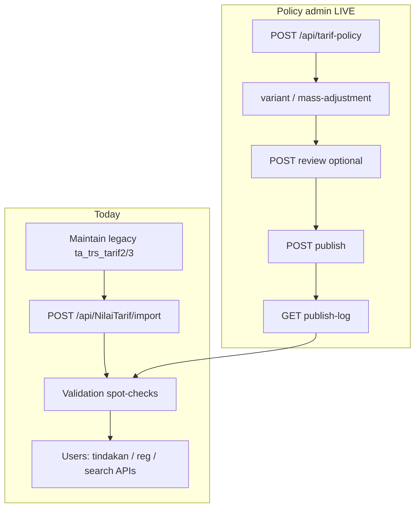

# Tarif Subsystem — Runbook

**Artifact role:** OPERATION — procedures, validation, recovery  
**Audience:** Keuangan, operator tarif, DBA, support

---

## Operational modes

| Mode | When | Primary action |
| ---- | ---- | -------------- |
| **Production today** | Day-to-day billing | Maintain legacy `ta_trs_tarif*` → **import** → verify `BILRG_*` |
| **Policy publish** | Draft/reviewed policy in `BILRG_Tarif*` | `POST .../publish` → verify `BILRG_*` + publish log |
| **HTTP policy workspace** | Phase 4 LIVE | `TarifPolicyController` — draft → publish |
| **Migration control** | Phase 5 LIVE | `GET /api/tarif-migration/status` — effective M0–M3 mode |

### Migration stages (M0–M3)

| Stage | `Tarif:Mode` (appsettings) | Routine import | Publish |
| ----- | -------------------------- | -------------- | ------- |
| **M0** | `ImportOnly` | Allowed | Blocked |
| **M1** | `Hybrid` | Allowed | Allowed |
| **M2** | `PublishPrimary` | Blocked (emergency only) | Allowed |
| **M3** | `ImportDeprecated` | Blocked (emergency only) | Allowed |

- **Config default:** `appsettings.json` → section `Tarif`.
- **DB override (ops):** `PUT /api/tarif-migration/mode` writes `BILRG_TarifOperationalState`; `DELETE /api/tarif-migration/mode` clears override.
- **Emergency import:** set `Tarif:AllowEmergencyImport` = `true` and call import with body `{ "isEmergency": true, "importedBy": "..." }`.

Detail: [`tarif-10-migration-strategy.md`](tarif-10-migration-strategy.md), checklist: [`tarif-09-rollout-checklist.md`](tarif-09-rollout-checklist.md).

This runbook covers import (HTTP), policy admin (HTTP), publish, and migration controls.

---

## Navigation overview



---

## [Live] Import projection workflow

### When to run

- After RS updates tariff in legacy transactional tables.
- Before go-live of new tariff set in Bilreg environment.
- During migration windows (coordinate with billing ops).

### Pre-deploy migration (existing environments)

Run once per environment **before** relying on unique variant constraint (greenfield: use `BILRG_NilaiTarif.sql`).

| Order | Script | Purpose |
| ----- | ------ | ------- |
| 1 | `Bilreg.SqlDb/.../BILRG_NilaiTarif_Phase0_DuplicateReport.sql` | Audit duplicates — archive output |
| 2 | `Bilreg.SqlDb/.../BILRG_NilaiTarif_Phase0_DuplicateCleanup.sql` | Keep `MAX(NilaiTarifId)` per `(TarifId, TipeTarifId, KelasId)` |
| 3 | `Bilreg.SqlDb/.../BILRG_NilaiTarif_Phase0_SourcePolicyId_Alter.sql` | Add `SourcePolicyId` column (empty for import) |
| 4 | `Bilreg.SqlDb/.../BILRG_NilaiTarif_Phase0_UX_Variant_Index.sql` | Unique index on variant key |

### Procedure

1. **Backup** `BILRG_NilaiTarif` and `BILRG_NilaiTarifKomponen` (or full DB per DBA policy).
2. Confirm legacy source rows:
   - Parent `ta_trs_tarif2.fd_tgl_expired = '3000-01-01'`
   - Line `ta_trs_tarif3.fn_nilai > 0`
3. Execute:

```http
POST /api/NilaiTarif/import
```

4. Verify row counts and spot-check critical variants (see validation below).
5. Notify operators to retry failed tindakan/reg only **after** import completes.

### Import behavior (know before run)

| Property | Detail |
| -------- | ------ |
| Scope | **Full** replace of both BILRG tables |
| Transaction | **LIVE** — `TransactionScope` via `TransHelper`; failure rolls back (handler logs + rethrows) |
| IDs | New `NilaiTarifId` (ULID) generated per variant row |
| Header nilai | Sum of komponen lines from legacy |

### Post-import validation checklist

**Business**

- [ ] Sample tariffs per layanan: nilai matches RS expectation
- [ ] Kelas + TipeTarif combinations exist for high-volume services
- [ ] No unexpected zero-nilai variants (import excludes `fn_nilai <= 0`)

**Accounting**

- [ ] Komponen lines map to expected `RekPdpt` / `RekDiskon` on master
- [ ] Total header = sum of komponen (by construction on import; spot-check)

**Operational**

- [ ] `GET /api/Tarif/nilai/{tarifId}/{tipeTarifId}/{kelasId}` returns expected breakdown
- [ ] `GET /api/NilaiTarif/tarif-brg?...` returns expected search hits
- [ ] Test create tindakan on one UMUM and one jaminan variant

**PPA / jasa**

- [ ] Komponen with PPA assignment has SatTugas on master (`ta_detil_tarif2`)
- [ ] Tindakan with PPA does not fail `IsValidPpa` for configured komponen

---

## Policy admin workflow (HTTP — LIVE)

See [`tarif-07-admin-workflow.md`](tarif-07-admin-workflow.md) and [`tarif-04-api-contract.md`](tarif-04-api-contract.md).

### Procedure

1. Ensure `BILRG_TarifPolicy*` tables deployed (Phase 2 SQL).
2. `POST /api/tarif-policy` — create draft SK.
3. `POST /api/tarif-policy/{id}/variant` — add/edit lines; optional `POST .../mass-adjustment`.
4. Optional: `POST .../review` (`Draft` → `Reviewed`).
5. Complete review checklist (below).
6. `POST /api/tarif-policy/{id}/publish` with `publishedBy` and `note`.
7. `GET /api/tarif-policy/{id}/publish-log` — confirm audit row.
8. Spot-check `GET /api/Tarif/nilai/{tarifId}/{tipeTarifId}/{kelasId}` for sample composites.

**MediatR fallback:** `TrfPublishTarifPolicyCmd` (same handler as HTTP publish).

### Procedure (publish only)

1. Policy in `Draft` or `Reviewed` (first publish) or `Published` (re-publish).
2. Publish via HTTP or MediatR.
3. On failure: transaction rolled back — fix validation error and retry; no partial projection.

### Ops mutex

Do **not** run full **import** and **publish** concurrently on the same environment (last writer wins per variant).

**LIVE (Phase 5):** API enforces an in-process lock — concurrent import + publish on the **same app instance** returns `InvalidOperationException`. Multi-instance deployments still require ops coordination (see [`tarif-10-migration-strategy.md`](tarif-10-migration-strategy.md)).

### Re-publish

Already `Published` policy may be re-published to refresh projection deterministically; each run adds a new publish log row.

### Periodic mass adjustment (dozens–hundreds of tariffs)

1. Create draft `TarifPolicy` with SK reference and informational effective date.
2. Optional: **copy** previous policy as template (new independent draft).
3. Run mass % adjustment on **draft variants only** (domain).
4. Complete review checklist.
5. **Manual publish** via HTTP — do not rely on effective date alone.
6. Post-publish spot-check same as import validation.

### Ad-hoc single-tariff change

1. Small operational policy (may precede signed SK).
2. Edit one or few variant lines via `POST`/`PUT .../variant`.
3. Publish with audit `Note` explaining urgency.
4. Verify affected variant only.

---

## Review checklist before publish / before import sign-off

| Area | Check |
| ---- | ----- |
| Variant | Correct tarif, kelas, tipe tarif; no duplicate composite |
| Nilai | Header and komponen amounts; mass % applied to intended scope only |
| Accounting | Every komponen has COA; breakdown sensible |
| Jasa | SatTugas mapping for PPA-enabled komponen |
| Layanan | Tarif visible in correct layanan search |
| Audit | `publishedBy`, `note`, `GET .../publish-log` |

---

## Audit workflow

| Event | Today | Target |
| ----- | ----- | ------ |
| Who changed operational nilai | Legacy `ta_trs_tarif*` + import operator log (manual) | Publish log + policy id |
| What was active at transaction time | `NilaiTarifId` / amounts on tindakan + `TrsBilling` snapshot | Same |
| SK reference | External document / legacy metadata | `TarifPolicy.PolicyNo` |

**Rule:** existing posted billing must **not** be recalculated when projection changes — investigate discrepancies via transaction snapshot, not by editing projection history retroactively.

---

## Mass adjustment (HTTP — LIVE)

`POST /api/tarif-policy/{id}/mass-adjustment` — `scope=ALL`, `adjustmentType=PERCENTAGE`, `value` = percent (e.g. `10` = +10%).

Component-scoped or fixed-amount adjustment is **not** implemented — use variant edit or copy + adjust.

Always preview draft totals before publish. Copy-policy is **template only** — confirm new policy id after `POST .../copy`.

---

## Troubleshooting

### Duplicate or ambiguous variant

**Symptoms:** Wrong nilai intermittently; composite load returns unexpected row.

**Checks:**

- Query `BILRG_NilaiTarif` for duplicate `(TarifId, TipeTarifId, KelasId)` (no unique index today).
- Re-import after cleaning legacy source duplicates.

### Wrong nilai after maintenance

**Causes:** Mass adjustment scope error; legacy line not under `3000-01-01` parent; zero-nilai lines excluded.

**Actions:**

- Compare legacy `ta_trs_tarif3` vs BILRG row.
- Re-run import after legacy fix.
- For posted transactions, compare tindakan/`TrsBilling` snapshot — do not “fix” by import alone.

### Import failed or partial BILRG

**Symptoms:** Empty picker; widespread 404 on get nilai.

**Recovery:**

1. Stop user traffic creating new tindakan if possible.
2. Restore `BILRG_*` from backup **or** re-run successful import.
3. Never leave tables empty in production without rollback plan.

### PPA / komponen eligibility errors

**Symptoms:** `ArgumentException` on tindakan create — invalid komponen/PPA.

**Actions:**

- Verify `ta_detil_tarif2` SatTugas links for komponen.
- Note: `KomponenRepo.SaveChanges` may not persist SatTugas — master edits via SQL/legacy tools until fixed.

### Search returns nothing

**Checks:** `layananId`, `kelasId`, `tipeTarifId`, keyword length; `ta_tarif4` layanan mapping; `FB_AKTIF` on tarif master.

---

## Rollback and recovery

| Scenario | Recommended action |
| -------- | ------------------ |
| Bad import | Restore BILRG tables from backup; or fix legacy and re-import |
| Wrong published policy *(future)* | New corrective policy + publish; **do not** mutate old `TarifVariant` |
| Wrong billing already posted | Billing correction process — **outside** Tarif |
| Need historical nilai at date | Today: legacy `ta_trs_tarif*`; future: `TarifVariant` archive |

---

## Phase 5 — Baseline backfill (optional, one-time)

Creates a **Published** `TarifPolicy` from current `BILRG_NilaiTarif*` (audit anchor). Does **not** change nilai; stamps `SourcePolicyId` via publish upsert.

### Preconditions

- [ ] Deploy `BILRG_TarifOperationalState.sql`
- [ ] `BILRG_*` populated and validated
- [ ] No existing policy with same `PolicyNo` (default `BASELINE-{yyyyMMdd}`)
- [ ] Mode allows publish (`Hybrid` or later)

### Procedure

1. `GET /api/tarif-migration/status` — confirm projection counts.
2. `GET /api/tarif-migration/consistency` — resolve duplicates before baseline if unhealthy.
3. `POST /api/tarif-migration/baseline` with JWT body `{ "userId": "...", "policyNo": "BASELINE-20260526" }` (optional policyNo).
4. Verify `GET /api/tarif-policy/{id}` and publish log; spot-check `SourcePolicyId` on sample `BILRG_NilaiTarif` rows.

### Rollback

Baseline is forward-only: do **not** delete published policy rows. If baseline was wrong, leave policy archived operationally and publish a corrective policy. Restore projection from backup only via standard import recovery (see below).

---

## Rollout order (engineering + ops)

1. Stabilize import procedure and backups (**done** — Phase 0).
2. Unique index on projection variant (**done** — Phase 0).
3. Policy draft API + publish engine (**done** — Phases 3–4).
4. Deploy Phase 5 SQL + API; set `Tarif:Mode` = `Hybrid` in UAT.
5. Optional baseline in UAT; train Keuangan on publish vs import authority.
6. Production: `PublishPrimary` after parallel validation; keep `AllowEmergencyImport` for fallback.
7. `ImportDeprecated` when routine legacy import is retired (endpoint remains for emergency).

---

## Operational ownership

| Task | Owner |
| ---- | ----- |
| Legacy tariff entry | RS keuangan / legacy admin |
| BILRG import execution | Authorized operator / DBA |
| Draft policy HTTP | Keuangan (JWT today; role gate future) |
| Publish | Supervisor / Direktur (role gate future) |
| Billing discrepancy | Billing support (snapshot-based) |

---

## FAQ

**Does effective date auto-activate tariff?**  
No — by design. *(Planned publish is manual; import has no date scheduler.)*

**Does import change existing billing lines?**  
No. Only **new** loads use refreshed projection.

**Can we edit BILRG directly in SQL?**  
Discouraged. Use legacy source + import, or future publish. Direct SQL bypasses audit and may desync from legacy.

**Where is TarifPolicy in the app?**  
HTTP API at `/api/tarif-policy` — UI may be separate; see [`tarif-07-admin-workflow.md`](tarif-07-admin-workflow.md).

---

## Related artifacts

| Path | Role |
| ---- | ---- |
| `docs/contexts/tarif/tarif-04-api-contract.md` | Endpoint reference |
| `docs/contexts/tarif/tarif-07-admin-workflow.md` | Draft → publish flow |
| `docs/contexts/tarif/tarif-09-rollout-checklist.md` | M0–M3 gates |
| `docs/contexts/tarif/tarif-10-migration-strategy.md` | Dual authority + fallback |
| `docs/contexts/tarif/tarif-03-design.md` | Import technical detail |
| `docs/tarif/tarif-codebase-retrieval-report.md` | Code/file index |
