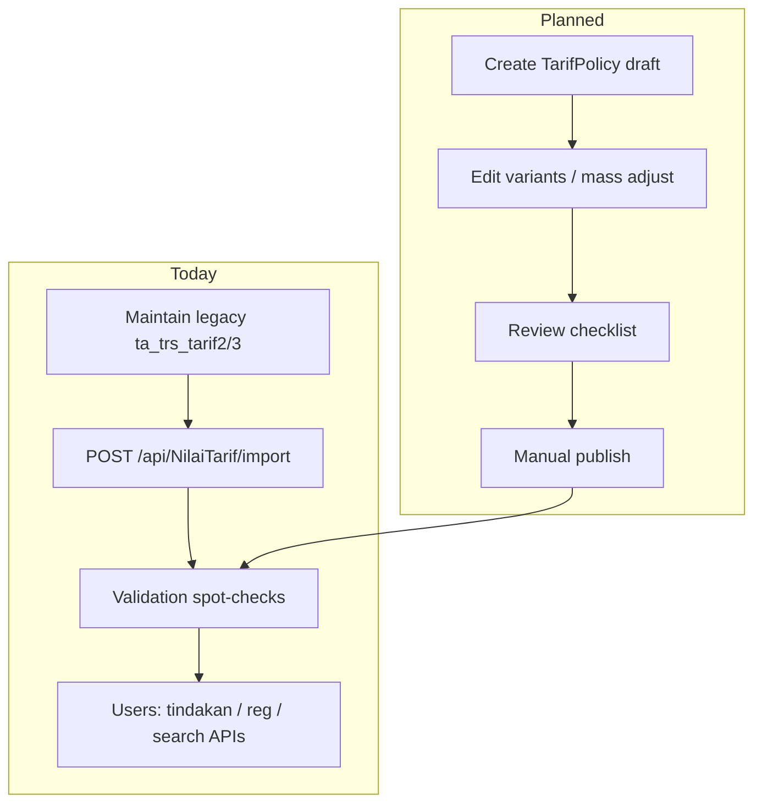

# Tarif Subsystem — Runbook

**Artifact role:** OPERATION — procedures, validation, recovery  
**Audience:** Keuangan, operator tarif, DBA, support

---

## Operational modes

| Mode | When | Primary action |
| ---- | ---- | -------------- |
| **Production today** | Day-to-day billing | Maintain legacy `ta_trs_tarif*` → **import** → verify `BILRG_*` |
| **Target** | After policy feature ships | Draft `TarifPolicy` → review → **manual publish** |

This runbook covers **both**; steps marked *(planned)* are not available in application yet.

---

## Navigation overview



---

## [Live] Import projection workflow

### When to run

- After RS updates tariff in legacy transactional tables.
- Before go-live of new tariff set in Bilreg environment.
- During migration windows (coordinate with billing ops).

### Pre-deploy migration (existing environments)

Run once per environment **before** relying on unique variant constraint (greenfield: use `BILRG_NilaiTarif.sql`).

| Order | Script | Purpose |
| ----- | ------ | ------- |
| 1 | `Bilreg.SqlDb/.../BILRG_NilaiTarif_Phase0_DuplicateReport.sql` | Audit duplicates — archive output |
| 2 | `Bilreg.SqlDb/.../BILRG_NilaiTarif_Phase0_DuplicateCleanup.sql` | Keep `MAX(NilaiTarifId)` per `(TarifId, TipeTarifId, KelasId)` |
| 3 | `Bilreg.SqlDb/.../BILRG_NilaiTarif_Phase0_SourcePolicyId_Alter.sql` | Add `SourcePolicyId` column (empty for import) |
| 4 | `Bilreg.SqlDb/.../BILRG_NilaiTarif_Phase0_UX_Variant_Index.sql` | Unique index on variant key |

### Procedure

1. **Backup** `BILRG_NilaiTarif` and `BILRG_NilaiTarifKomponen` (or full DB per DBA policy).
2. Confirm legacy source rows:
   - Parent `ta_trs_tarif2.fd_tgl_expired = '3000-01-01'`
   - Line `ta_trs_tarif3.fn_nilai > 0`
3. Execute:

```http
POST /api/NilaiTarif/import
```

4. Verify row counts and spot-check critical variants (see validation below).
5. Notify operators to retry failed tindakan/reg only **after** import completes.

### Import behavior (know before run)

| Property | Detail |
| -------- | ------ |
| Scope | **Full** replace of both BILRG tables |
| Transaction | **LIVE** — `TransactionScope` via `TransHelper`; failure rolls back (handler logs + rethrows) |
| IDs | New `NilaiTarifId` (ULID) generated per variant row |
| Header nilai | Sum of komponen lines from legacy |

### Post-import validation checklist

**Business**

- [ ] Sample tariffs per layanan: nilai matches RS expectation
- [ ] Kelas + TipeTarif combinations exist for high-volume services
- [ ] No unexpected zero-nilai variants (import excludes `fn_nilai <= 0`)

**Accounting**

- [ ] Komponen lines map to expected `RekPdpt` / `RekDiskon` on master
- [ ] Total header = sum of komponen (by construction on import; spot-check)

**Operational**

- [ ] `GET /api/Tarif/nilai/{tarifId}/{tipeTarifId}/{kelasId}` returns expected breakdown
- [ ] `GET /api/NilaiTarif/tarif-brg?...` returns expected search hits
- [ ] Test create tindakan on one UMUM and one jaminan variant

**PPA / jasa**

- [ ] Komponen with PPA assignment has SatTugas on master (`ta_detil_tarif2`)
- [ ] Tindakan with PPA does not fail `IsValidPpa` for configured komponen

---

## *(Planned)* Policy draft and publish workflow

### Periodic mass adjustment (dozens–hundreds of tariffs)

1. Create draft `TarifPolicy` with SK reference and informational effective date.
2. Optional: **copy** previous policy as template (new independent draft).
3. Run mass % or komponen-scoped adjustment on **draft variants only**.
4. Incremental manual edits over days if needed.
5. Complete review checklist (below).
6. **Manual publish** — do not rely on effective date alone.
7. Post-publish spot-check same as import validation.

### Ad-hoc single-tariff change

1. Small operational policy (may precede signed SK).
2. Edit one or few `TarifVariant` lines.
3. Publish with audit note explaining urgency.
4. Verify affected variant only.

---

## Review checklist before publish *(planned)* / before import sign-off *[live]*

| Area | Check |
| ---- | ----- |
| Variant | Correct tarif, kelas, tipe tarif; no duplicate composite |
| Nilai | Header and komponen amounts; mass % applied to intended scope only |
| Accounting | Every komponen has COA; breakdown sensible |
| Jasa | SatTugas mapping for PPA-enabled komponen |
| Layanan | Tarif visible in correct layanan search |
| Audit | Operator, timestamp, policy/SK note recorded *(planned publish log)* |

---

## Audit workflow

| Event | Today | Target |
| ----- | ----- | ------ |
| Who changed operational nilai | Legacy `ta_trs_tarif*` + import operator log (manual) | Publish log + policy id |
| What was active at transaction time | `NilaiTarifId` / amounts on tindakan + `TrsBilling` snapshot | Same |
| SK reference | External document / legacy metadata | `TarifPolicy.PolicyNo` |

**Rule:** existing posted billing must **not** be recalculated when projection changes — investigate discrepancies via transaction snapshot, not by editing projection history retroactively.

---

## Mass adjustment *(planned)*

| Tool | Example use |
| ---- | ----------- |
| All tariffs +10% | Annual SK |
| Komponen jasa +7% | Doctor fee component only |
| Lab group only | Selective scope |

Always preview draft totals before publish. Copy-policy is **template only** — confirm policy id after copy.

---

## Troubleshooting

### Duplicate or ambiguous variant

**Symptoms:** Wrong nilai intermittently; composite load returns unexpected row.

**Checks:**

- Query `BILRG_NilaiTarif` for duplicate `(TarifId, TipeTarifId, KelasId)` (no unique index today).
- Re-import after cleaning legacy source duplicates.

### Wrong nilai after maintenance

**Causes:** Mass adjustment scope error; legacy line not under `3000-01-01` parent; zero-nilai lines excluded.

**Actions:**

- Compare legacy `ta_trs_tarif3` vs BILRG row.
- Re-run import after legacy fix.
- For posted transactions, compare tindakan/`TrsBilling` snapshot — do not “fix” by import alone.

### Import failed or partial BILRG

**Symptoms:** Empty picker; widespread 404 on get nilai.

**Recovery:**

1. Stop user traffic creating new tindakan if possible.
2. Restore `BILRG_*` from backup **or** re-run successful import.
3. Never leave tables empty in production without rollback plan.

### PPA / komponen eligibility errors

**Symptoms:** `ArgumentException` on tindakan create — invalid komponen/PPA.

**Actions:**

- Verify `ta_detil_tarif2` SatTugas links for komponen.
- Note: `KomponenRepo.SaveChanges` may not persist SatTugas — master edits via SQL/legacy tools until fixed.

### Search returns nothing

**Checks:** `layananId`, `kelasId`, `tipeTarifId`, keyword length; `ta_tarif4` layanan mapping; `FB_AKTIF` on tarif master.

---

## Rollback and recovery

| Scenario | Recommended action |
| -------- | ------------------ |
| Bad import | Restore BILRG tables from backup; or fix legacy and re-import |
| Wrong published policy *(future)* | New corrective policy + publish; **do not** mutate old `TarifVariant` |
| Wrong billing already posted | Billing correction process — **outside** Tarif |
| Need historical nilai at date | Today: legacy `ta_trs_tarif*`; future: `TarifVariant` archive |

---

## Rollout order (engineering + ops)

1. Stabilize import procedure and backups (**now**).
2. Add DB unique constraint on projection variant (**backlog**).
3. Introduce `TarifPolicy` draft UI/API.
4. Introduce publish log + transactional publish.
5. Train Keuangan on publish vs effective date.
6. Reduce import frequency as publish becomes authoritative.

---

## Operational ownership

| Task | Owner |
| ---- | ----- |
| Legacy tariff entry | RS keuangan / legacy admin |
| BILRG import execution | Authorized operator / DBA |
| Draft policy *(planned)* | Keuangan |
| Publish approval *(planned)* | Supervisor / Direktur |
| Billing discrepancy | Billing support (snapshot-based) |

---

## FAQ

**Does effective date auto-activate tariff?**  
No — by design. *(Planned publish is manual; import has no date scheduler.)*

**Does import change existing billing lines?**  
No. Only **new** loads use refreshed projection.

**Can we edit BILRG directly in SQL?**  
Discouraged. Use legacy source + import, or future publish. Direct SQL bypasses audit and may desync from legacy.

**Where is TarifPolicy in the app?**  
Not implemented — use legacy + import until publish feature ships.

---

## Related artifacts

| Path | Role |
| ---- | ---- |
| `docs/contexts/tarif/tarif-04-api-contract.md` | Endpoint reference |
| `docs/contexts/tarif/tarif-03-design.md` | Import technical detail |
| `docs/tarif/tarif-codebase-retrieval-report.md` | Code/file index |
