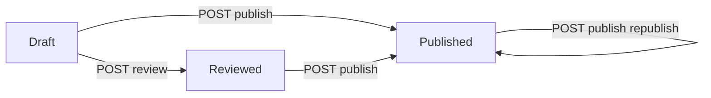

# Tarif Subsystem — Admin Workflow (Phase 4)

**Bounded context:** `ChargeContext` / Tarif  
**Artifact role:** HOW — operational policy workspace (HTTP + state rules)  
**Status:** **LIVE**

**Code:**

| Piece | Path |
| ----- | ---- |
| HTTP | `Bilreg.Api/Controllers/ChargeContext/TarifPolicyController` |
| Handlers | `Bilreg.Application/ChargeContext/TarifFeature/UseCases/Trf*TarifPolicy*` |
| Domain | `TarifPolicyType`, `TarifVariantType` |
| Publish | `TrfPublishTarifPolicyCmd` — see [`tarif-06-publish-engine.md`](tarif-06-publish-engine.md) |

---

## Purpose

Give Keuangan operators an **explicit, linear** workspace to manage tariff SK (policy) drafts and activate them into the operational `BILRG_NilaiTarif*` projection — without a workflow engine, approval framework, or generic state machine.

---

## Policy status (simple transitions)

| Status | Editable (metadata + variants) | Next actions |
| ------ | ------------------------------ | ------------ |
| `Draft` | Yes | Edit, review, publish |
| `Reviewed` | Yes | Edit, publish |
| `Published` | No (variants/metadata locked) | Re-publish only (projection refresh) |
| `Archived` | No | — |

Transitions:

- **Create** → `Draft`
- **Review** (`POST .../review`) → `Reviewed` (from `Draft` only)
- **Publish** (first) → `Published`
- **Re-publish** → stays `Published`; new publish log row

There is **no** lineage between policies. **Copy** creates a new independent `Draft`.

---

## Operational flow

```text
1. POST /api/tarif-policy              → Draft SK
2. POST /api/tarif-policy/{id}/variant → add lines (repeat)
3. POST .../mass-adjustment            → optional % on all variants
4. POST .../review                     → Draft → Reviewed (optional gate)
5. POST .../publish                    → projection + Published
6. GET  .../publish-log                → audit visibility
```



---

## HTTP surface

Full contract: [`tarif-04-api-contract.md`](tarif-04-api-contract.md).

| Concern | Rule |
| ------- | ---- |
| Auth | JWT required (`[Authorize]` on controller) |
| Role gates | **Not implemented** in Phase 4 — plan Keuangan/Supervisor when role IDs exist |
| User audit | `userId` / `publishedBy` in request body (project convention) |
| Errors | `ErrorHandlerMiddleware` → JSend 400 for business/not-found |

---

## Handler orchestration pattern

Every mutating handler:

1. `TrfTarifPolicySupport.LoadPolicy` (or create)
2. Domain method (`AddVariant`, `UpdateMetadata`, `MarkReviewed`, …)
3. `ITarifPolicyRepo.SaveChanges`

**Publish** delegates to `TrfPublishTarifPolicyHandler` (transactional — log + projection + policy save).

`TarifPolicyRepo.SaveChanges` does **not** call `EnsureEditable()` — handlers must use domain guards before save.

---

## Variant rules

| Rule | Enforced in |
| ---- | ----------- |
| Unique `(TarifId, KelasId, TipeTarifId)` per policy | `AddVariant`, `UpdateVariant` |
| Σ komponen = header nilai | `TarifVariantType` |
| ≥ 1 komponen line at publish | `EnsureValidForPublish` |
| Mass adjust | `PERCENTAGE` on `scope=ALL` only |

---

## Copy policy

`POST /api/tarif-policy/{id}/copy` → `TarifPolicyType.CopyFrom`:

- New `TarifPolicyId`
- Status `Draft`
- Cloned variants (cleared `PublishedNilaiTarifId`)
- **No** parent/child link to source

---

## Related artifacts

| Path | Role |
| ---- | ---- |
| [`tarif-04-api-contract.md`](tarif-04-api-contract.md) | Route + payload reference |
| [`tarif-05-runbook.md`](tarif-05-runbook.md) | Ops checklist |
| [`tarif-06-publish-engine.md`](tarif-06-publish-engine.md) | Publish transaction detail |
| [`tarif-02-domain.md`](tarif-02-domain.md) | Aggregate invariants |
