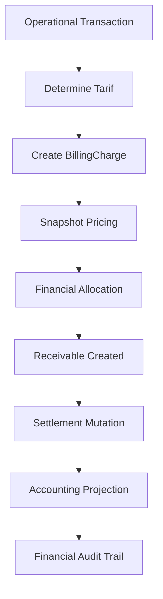

# 01-context.md — TRSBILLING

## FEATURE NAME

TRSBILLING (`BillingCharge`)

## PURPOSE

Menyediakan ledger finansial operasional rumah sakit yang bertanggung jawab untuk mengakui, menyimpan, dan memelihara seluruh piutang/tagihan pasien secara immutable berdasarkan aktivitas operasional yang terjadi pada subsystem lain.

TRSBILLING menjadi sumber kebenaran finansial (`financial truth`) terhadap:

- pengakuan charge,
- snapshot tarif,
- alokasi penanggung jawab biaya,
- mutasi settlement,
- proyeksi accounting.

## BUSINESS PROBLEM

Pada sistem legacy HIS, transaksi operasional dan transaksi finansial sering bercampur dalam satu model data. Akibatnya:

- perubahan tarif historis dapat mempengaruhi transaksi lama,
- ownership piutang sulit ditelusuri,
- mutasi settlement tidak memiliki histori yang jelas,
- subsystem operasional menjadi terlalu mengetahui detail billing,
- rekonsiliasi accounting menjadi sulit.

TRSBILLING memisahkan:

```text
Operational Truth
```

dan:

```text
Financial Truth
```

sehingga setiap aktivitas operasional dapat diproyeksikan menjadi charge finansial yang immutable dan accounting-ready.

## FEATURE SCOPE

| In scope | Out of scope (lihat OUT OF SCOPE) |
| --- | --- |
| Pengakuan charge pasien | Engine tindakan medis |
| Snapshot tarif saat transaksi | Workflow klinis |
| Snapshot komponen tarif | Inventory movement |
| Snapshot group rekening obat | Payment gateway |
| Penyimpanan source transaction | Accounting jurnal umum |
| Financial responsibility allocation | GL posting engine |
| Settlement mutation | BPJS claim orchestration |
| Piutang pasien dan penjamin | Cashier payment processing |
| Financial audit trail | LIS / radiologi internals |
| Accounting-ready mutation projection | Engine tarif generator generik |
| Void / reversal financial mutation | Master inventory |
| Pricing immutability | |

## USER ROLE

| Role | Tanggung jawab operasional |
| --- | --- |
| Billing Officer | Monitoring charge dan mutasi piutang |
| Kasir | Settlement dan pembayaran piutang |
| Staff Tata Rekening | Rekonsiliasi billing dan ownership piutang |
| Admin Keuangan | Audit financial mutation dan correction |
| Subsystem Operasional | Mengirim source transaction pembentuk charge |
| DBA / Operator | Investigasi dan rekonsiliasi data finansial |

## OPERATIONAL FLOW

Alur operasional standar:

1. Subsystem operasional menghasilkan transaksi sumber (`source transaction`).
2. Sistem menentukan tarif aktif berdasarkan policy dan variant tarif.
3. TRSBILLING membuat `BillingCharge` sebagai snapshot finansial immutable.
4. Snapshot tarif, komponen tarif, dan ownership finansial disimpan.
5. Charge diproyeksikan menjadi piutang pasien / penjamin.
6. Settlement mutation dapat terjadi akibat pembayaran, penjaminan, koreksi, atau transfer ownership.
7. Accounting projection disediakan untuk subsystem accounting.
8. Void / reversal dilakukan sebagai mutation baru; histori lama tidak dihapus.



## BUSINESS RULE

| Rule | Ringkasan |
| --- | --- |
| Financial truth authority | TRSBILLING adalah sumber kebenaran finansial |
| Immutable pricing snapshot | Tarif historis tidak boleh berubah setelah charge dibuat |
| Operational source required | Semua charge wajib memiliki source transaction |
| Charge projection | Aktivitas operasional diproyeksikan menjadi piutang finansial |
| Settlement append-only | Settlement dan reversal dicatat sebagai mutation baru |
| Financial auditability | Semua perubahan ownership dan settlement harus dapat ditelusuri |
| Tariff independence | Perubahan tarif baru tidak mempengaruhi charge lama |
| Accounting projection consistency | Mutation harus dapat diproyeksikan ke accounting |
| Responsibility allocation | Satu charge dapat memiliki penanggung jawab berbeda |
| Void as mutation | Void tidak menghapus histori charge |
| Commercial authority | Nilai finansial final berada pada snapshot charge |
| Operational decoupling | Subsystem operasional tidak mengetahui detail settlement |

## TERMINOLOGY

| Term | Makna operasional |
| --- | --- |
| TRSBILLING | Domain financial receivable rumah sakit |
| BillingCharge | Aggregate utama charge finansial |
| Charge | Pengakuan piutang akibat aktivitas operasional |
| Financial Truth | Kebenaran finansial resmi rumah sakit |
| Operational Truth | Fakta operasional yang terjadi di subsystem sumber |
| Pricing Snapshot | Snapshot tarif saat transaksi terjadi |
| Source Transaction | Transaksi operasional pembentuk charge |
| Financial Allocation | Pembagian penanggung jawab biaya |
| Settlement Mutation | Perubahan ownership atau penyelesaian piutang |
| Receivable | Piutang yang harus dibayar |
| Tarif Policy | Kebijakan tarif aktif |
| Tarif Variant | Variant tarif berdasarkan policy tertentu |
| Komponen Tarif | Struktur rincian jasa pembentuk charge |
| Grup Rekening | Struktur rincian obat / farmasi pembentuk charge |
| Accounting Projection | Representasi mutation untuk accounting |
| Immutable Ledger | Histori finansial tidak diubah secara destructive |
| Reversal | Mutation pembalik transaksi finansial |
| Penjamin | Entitas yang bertanggung jawab atas pembayaran |

## EXTERNAL DEPENDENCY

| Sistem | Peran |
| --- | --- |
| Admisi / Registrasi | Sumber identitas registrasi pasien |
| IGD / Rawat Jalan / Rawat Inap | Source transaction pelayanan |
| Farmasi | Source transaction obat dan BHP |
| LIS / Radiologi | Source transaction pemeriksaan |
| Tata Rekening | Settlement dan rekonsiliasi billing |
| Accounting | Konsumsi accounting projection |
| Master Tarif | Penyedia policy dan variant tarif |
| Payment / Kasir | Penyelesaian pembayaran |

## NON FUNCTIONAL REQUIREMENT

| Area | Requirement |
| --- | --- |
| Financial Integrity | Histori charge dan settlement harus immutable |
| Auditability | Seluruh mutation wajib memiliki audit trail |
| Consistency | Financial allocation dan settlement harus konsisten secara transaksi |
| Availability | Billing harus tersedia untuk operasi rumah sakit 24/7 |
| Traceability | Semua charge harus dapat ditelusuri ke source transaction |
| Historical Accuracy | Tarif historis wajib tetap konsisten |
| Maintainability | Monolith eksplisit; tanpa distributed saga |
| Scalability | Mendukung volume transaksi billing rumah sakit besar |
| Recoverability | Mutation finansial dapat direkonsiliasi setelah insiden |
| Performance | Query billing dan receivable tetap responsif pada volume tinggi |

## OUT OF SCOPE

- Workflow klinis dan tindakan medis
- Inventory stock movement
- Engine payment gateway
- General ledger posting penuh
- Sistem accounting umum
- BPJS claim adjudication
- Medical coding dan grouping INA-CBG
- Queue management
- Orchestration distributed transaction
- Event sourcing penuh
- Dynamic pricing AI / rules engine kompleks
- Master tarif authoring UI

