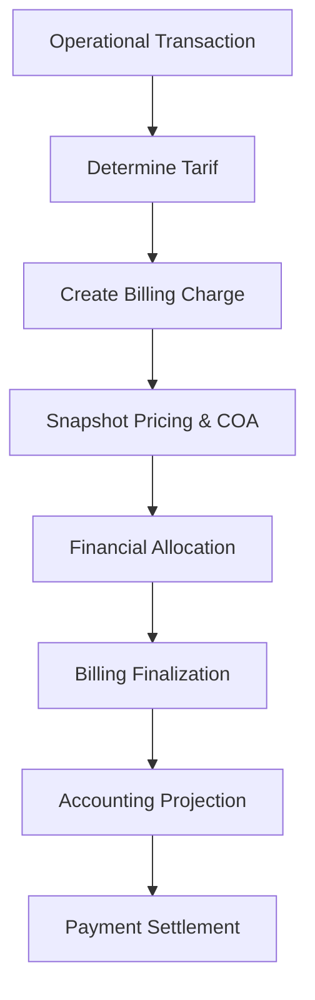

# 01-context.md — TRSBILLING

## FEATURE NAME

TRSBILLING (`BillingCharge`)

---

# PURPOSE

Provide the hospital operational financial ledger responsible for recognizing, storing, and maintaining patient receivables/billing generated from operational transactions across hospital subsystems.

TRSBILLING acts as the operational financial truth for:

- billing recognition,
- pricing snapshot,
- financial responsibility allocation,
- billing settlement,
- accounting projection.

TRSBILLING is designed with:

```text
legacy compatibility first
```

while gradually improving:
- financial consistency,
- integration boundary clarity,
- accounting projection quality,
- pricing snapshot integrity.

---

# BUSINESS PROBLEM

In legacy HIS systems, operational transactions and financial receivables are often tightly coupled.

As a result:

- historical pricing may become inconsistent,
- operational subsystem becomes tightly coupled to billing internals,
- accounting projection becomes difficult to reconcile,
- ownership allocation becomes difficult to maintain,
- subsystem integration becomes fragile.

TRSBILLING separates:

```text
Operational Truth
```

from:

```text
Financial Truth
```

where:

| Concern | Authority |
|---|---|
| Operational activity | source subsystem |
| Financial receivable | TRSBILLING |
| Settlement & payment | cashier / finance |
| Accounting journal | accounting subsystem |

TRSBILLING focuses on:

```text
current-state financial receivable management
```

instead of full immutable enterprise financial event sourcing.

---

# FEATURE SCOPE

| In Scope | Out of Scope |
|---|---|
| Billing recognition | Clinical workflow engine |
| Pricing snapshot | Medical procedure engine |
| Tarif component snapshot | Inventory stock movement |
| Drug account-group snapshot | Payment gateway |
| Source transaction snapshot | General ledger engine |
| Financial responsibility allocation | Full accounting system |
| Billing settlement tracking | BPJS claim orchestration |
| Patient receivable management | LIS internal workflow |
| Accounting projection source | Radiology internal workflow |
| Legacy billing compatibility | Distributed transaction orchestration |
| Billing finalization | Dynamic AI pricing engine |
| Async accounting projection | Master tarif authoring UI |

---

# USER ROLE

| Role | Responsibility |
|---|---|
| Billing Officer | Monitor patient billing and receivable |
| Cashier | Process payment and settlement |
| Tata Rekening Staff | Billing verification and allocation |
| Finance Admin | Accounting reconciliation |
| Operational Subsystem | Generate operational charge source |
| DBA / Operator | Financial troubleshooting and reconciliation |

---

# OPERATIONAL FLOW

Standard operational flow:

1. Operational subsystem generates source transaction.
2. System determines active tarif and pricing policy.
3. TRSBILLING creates billing charge snapshot.
4. Pricing snapshot and accounting snapshot are stored.
5. Financial responsibility allocation is applied.
6. Billing remains mutable until finalized.
7. Accounting projection is generated asynchronously.
8. Payment settlement finalizes billing ownership.



---

# BUSINESS RULE

| Rule | Description |
|---|---|
| Financial truth authority | TRSBILLING is the operational financial truth |
| Pricing snapshot immutable | Historical pricing must remain unchanged |
| Accounting snapshot immutable | Historical accounting mapping must remain unchanged |
| Operational source required | Every billing charge must have source transaction |
| Mutable before finalization | Billing may still change before finalization |
| Financial freeze after payment | Billing becomes immutable after settlement/payment |
| Source history authority | Operational history belongs to source transaction |
| Responsibility allocation | One billing may have multiple responsibility owners |
| Legacy compatibility first | Existing billing tables remain authoritative |
| Async accounting projection | Journal generation runs asynchronously |
| Operational decoupling | Operational subsystem must not know billing internals |

---

# TERMINOLOGY

| Term | Meaning |
|---|---|
| TRSBILLING | Hospital financial receivable domain |
| BillingCharge | Financial billing aggregate |
| Charge | Financial receivable recognition |
| Financial Truth | Official operational financial state |
| Operational Truth | Operational activity from source subsystem |
| Pricing Snapshot | Historical pricing captured during transaction |
| Accounting Snapshot | Historical accounting mapping snapshot |
| Source Transaction | Operational transaction generating billing |
| Financial Allocation | Responsibility allocation for payment |
| Billing Settlement | Payment and receivable settlement |
| Billing Finalization | Financial closing/finalization process |
| Tarif Policy | Active pricing policy |
| Tarif Variant | Pricing variant for payer/class |
| Tarif Component | Service billing component |
| Rekening Group | Drug/inventory accounting grouping |
| Accounting Projection | Accounting-ready journal source |
| Penjamin | Financial responsibility owner / guarantor |

---

# EXTERNAL DEPENDENCY

| System | Responsibility |
|---|---|
| Registration / Admission | Patient registration source |
| IGD / Outpatient / Inpatient | Operational service source |
| Pharmacy | Drug and inventory charge source |
| LIS / Radiology | Diagnostic charge source |
| Tata Rekening | Billing verification and settlement |
| Accounting | Journal generation consumer |
| Tarif Master | Tarif and pricing provider |
| Cashier / Payment | Payment settlement |

---

# NON FUNCTIONAL REQUIREMENT

| Area | Requirement |
|---|---|
| Financial Consistency | Billing and settlement must remain transactionally consistent |
| Historical Accuracy | Pricing snapshot must remain historically accurate |
| Accounting Consistency | Accounting snapshot must remain historically accurate |
| Traceability | Billing must trace back to source transaction |
| Availability | Billing subsystem must support 24/7 hospital operation |
| Maintainability | Explicit monolith architecture |
| Scalability | Must support large hospital transaction volume |
| Recoverability | Recovery via source transaction reconciliation |
| Performance | Billing and receivable query must remain responsive |
| Compatibility | Existing legacy billing table remains authoritative |

---

# OUT OF SCOPE

- Clinical workflow management
- Inventory stock management
- Full accounting journal engine
- General ledger system
- Payment gateway orchestration
- BPJS claim adjudication
- INA-CBG grouping
- Distributed saga orchestration
- Full event sourcing architecture
- AI pricing engine
- Tarif authoring management