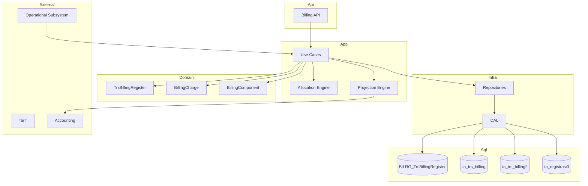

# 03-design.md — TRSBILLING

## FEATURE NAME

TRSBILLING (`TrsBillingRegister`)

---

# DESIGN OVERVIEW

Implementation follows:

```text
Clean Architecture
+
Pragmatic Tactical DDD
+
Legacy Compatibility First
```

TRSBILLING design prioritizes:
- aggregate clarity,
- operational stability,
- accounting compatibility,
- transactional consistency,
- low-risk migration.

Core principle:

```text
registration-scoped orchestration
+
legacy financial persistence
```

---

# ARCHITECTURE



---

# AGGREGATE IMPLEMENTATION

## Aggregate Root

```text
TrsBillingRegister
```

Persistence:

```text
BILRG_TrsBillingRegister
```

Purpose:
- lifecycle orchestration,
- finalize/reopen control,
- settlement boundary,
- concurrency boundary.

---

## Child Entity

### `BillingCharge`

Persistence:

```text
ta_trs_billing
```

Purpose:
- authoritative financial charge,
- pricing snapshot,
- source transaction snapshot.

---

## Child Projection

### `BillingComponent`

Persistence:

```text
ta_trs_billing2
```

Purpose:
- financial decomposition,
- payer allocation projection,
- accounting projection source.

NOT:
- event sourcing stream,
- immutable history,
- accounting journal.

---

# PERSISTENCE DESIGN

## `BILRG_TrsBillingRegister`

Stores:
- RegId,
- BillState,
- CloseDate,
- FinalizeDate,
- PaidDate,
- orchestration metadata.

Does NOT store:
- financial totals,
- pricing amount,
- accounting amount.

Reason:
- financial authority remains in legacy tables.

---

## `ta_trs_billing`

Remains:
- authoritative billing persistence,
- legacy-compatible financial row,
- pricing snapshot authority.

---

## `ta_trs_billing2`

Remains:
- financial distribution projection,
- accounting-ready decomposition,
- payer allocation projection.

Rows may be:
- deleted,
- regenerated,
- recalculated.

---

# BILLING LIFECYCLE IMPLEMENTATION

```text
OPEN
    ↓
CLOSE BILL
    ↓
FINALIZED
    ↓
PAID
```

---

## OPEN

Allowed:
- add charge,
- remove charge,
- allocation recalculation,
- projection regeneration.

---

## CLOSE BILL

Triggered by:
- discharge,
- operational closing,
- outpatient completion.

Effects:
- operational billing generation disabled,
- recalculation still allowed.

---

## FINALIZED

Triggered by:
- Tata Rekening verification,
- auto-finalize workflow,
- cashier-ready validation.

Effects:
- allocation locked,
- accounting projection stable,
- reopen restricted.

---

## PAID

Triggered by:
- payment settlement.

Effects:
- financial freeze,
- no operational modification,
- no allocation regeneration.

---

# TRANSACTION STRATEGY

TRSBILLING uses:

# synchronous transactional persistence

No distributed saga.

---

## Transaction Boundary

Transaction scope exists at:

```text
registration aggregate scope
```

NOT billing-row scope.

---

## Required Atomic Operations

| Use Case | Transaction Scope |
|---|---|
| Create Charge | aggregate + billing + projection |
| Recalculate Allocation | delete old projection + regenerate |
| Close Bill | lifecycle update + projection sync |
| Finalize Bill | finalize state + projection validation |
| Payment Settlement | settlement + freeze validation |

---

# ALLOCATION IMPLEMENTATION

Allocation authority source:

```text
ta_registrasi3
```

Allocation strategy:

```text
proportional decomposition
```

across:
- billing charge,
- tarif component,
- payer allocation.

---

## Allocation Process

```text
Load payer allocation
    ↓
Load billing components
    ↓
Calculate proportional value
    ↓
Generate billing2 projection rows
```

---

# PROJECTION REGENERATION STRATEGY

Projection regeneration uses:

```text
DELETE
→ REGENERATE
```

Reason:
- billing2 is derived projection,
- not immutable financial history.

---

## Regeneration Trigger

Triggered when:
- payer allocation changes,
- billing recalculation occurs,
- reopen occurs,
- finalize rollback occurs.

---

# CONCURRENCY STRATEGY

Concurrency controlled at:

```text
TrsBillingRegister
```

NOT:
- billing row,
- projection row.

---

## Concurrency Goals

Prevent:
- double finalize,
- reopen-after-payment,
- duplicate projection regeneration,
- concurrent settlement.

---

## Recommended Strategy

| Area | Strategy |
|---|---|
| Finalize | aggregate state validation |
| Reopen | paid-state validation |
| Settlement | paid-state CAS |
| Projection regeneration | transaction lock |

---

# SOURCE TRANSACTION STRATEGY

Operational subsystem:
- directly creates billing,
- synchronously persists financial charge.

Integration pattern:

```text
Subsystem
→ Charge Request
→ TRSBILLING
```

---

## Idempotency

Idempotency key:

```text
OrderNumber
```

Purpose:
- retry-safe integration,
- duplicate prevention.

---

# ACCOUNTING PROJECTION DESIGN

TRSBILLING acts as:

# accounting-ready projection source

Accounting journal generation remains:
- asynchronous,
- externalized,
- legacy-compatible.

---

## Posting Strategy

Posting status remains compatible with:
- existing accounting workflow,
- existing posting cronjob,
- existing billing2 posting mechanism.

Future enhancement MAY:
- introduce aggregate-level posting state,
- introduce posting batch tracking.

WITHOUT:
- breaking legacy accounting integration.

---

# QUERY STRATEGY

| Query | Purpose |
|---|---|
| Get Register Billing | aggregate detail |
| List Open Bill | operational monitoring |
| List Finalized Bill | cashier queue |
| List Unposted Projection | accounting projection |
| Allocation Projection | financial decomposition |

---

# SECURITY DESIGN

Sensitive operation:
- finalize,
- reopen,
- settlement,
- allocation recalculation.

Authorization remains compatible with:
- existing HIS authorization,
- cashier workflow,
- Tata Rekening authority.

---

# PERFORMANCE DESIGN

Optimized for:
- large transaction volume,
- legacy SQL workload,
- accounting batch projection.

---

## Recommended Index

| Table | Index |
|---|---|
| `BILRG_TrsBillingRegister` | RegId, BillState |
| `ta_trs_billing` | RegId, TrsId |
| `ta_trs_billing2` | posting flag |
| `ta_trs_billing2` | payer type |

---

# ERROR HANDLING STRATEGY

## Domain Validation

Prevent:
- invalid lifecycle transition,
- settlement before finalize,
- reopen after payment,
- duplicate charge.

---

## Application Validation

Rollback on:
- projection regeneration failure,
- settlement failure,
- finalize validation failure.

---

# AI IMPLEMENTATION NOTE

When implementing:

1. Aggregate boundary is:
   ```text
   registration scope
   ```

2. `TrsBillingRegister` is:
   - orchestration aggregate,
   - NOT financial authority.

3. `ta_trs_billing` remains:
   - financial authority,
   - legacy-compatible source.

4. `ta_trs_billing2` is:
   - derived financial projection,
   - NOT immutable history.

5. Projection recalculation MUST use:
   ```text
   DELETE → REGENERATE
   ```

6. Pricing snapshot and accounting snapshot are immutable.

7. Prefer:
   - compatibility,
   - operational stability,
   - accounting continuity

   over architectural purity.

8. Do NOT redesign accounting workflow.

9. Do NOT convert billing2 into event sourcing model.

10. Lifecycle orchestration belongs to:
    ```text
    TrsBillingRegister
    ```

---

# TESTING STRATEGY

| Area | Validation |
|---|---|
| Lifecycle | OPEN → CLOSE → FINALIZED → PAID |
| Allocation | proportional decomposition |
| Projection | delete-regenerate consistency |
| Settlement | freeze validation |
| Snapshot | historical consistency |
| Idempotency | duplicate prevention |
| Reopen | payment restriction |

---

# DEPLOYMENT STRATEGY

Deployment uses:

# incremental compatibility-first rollout

Principles:
- preserve existing billing tables,
- preserve accounting integration,
- preserve cashier workflow,
- additive migration only.

---

# FUTURE EXTENSION POINT

| Area | Extension |
|---|---|
| Posting | aggregate posting state |
| Projection | async projection queue |
| Monitoring | reconciliation dashboard |
| Allocation | configurable decomposition |
| Integration | centralized charge gateway |

WITHOUT:
- replacing accounting module,
- replacing cashier workflow,
- requiring big-bang migration.