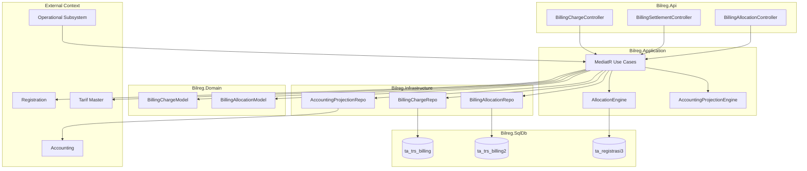

# 03-design.md — TRSBILLING

## FEATURE NAME

TRSBILLING (`BillingCharge`)

---

# DESIGN OVERVIEW

Implementation follows:

```text
Clean Architecture
+
Pragmatic Tactical DDD
+
Legacy Compatibility First
```

Design prioritizes:
- compatibility with existing HIS billing structure,
- operational stability,
- accounting continuity,
- gradual semantic clarification.

TRSBILLING is designed as:

# Operational Financial Receivable Ledger

NOT:
- full accounting journal engine,
- immutable event sourcing ledger,
- distributed financial orchestration system.

Core design principle:

```text
current-state financial receivable
with immutable pricing/accounting snapshot
```

Architecture preserves:
- existing `ta_trs_billing`,
- existing `ta_trs_billing2`,
- existing cashier/accounting workflow,
- synchronous operational billing generation.

---

# ARCHITECTURE



Layer dependency:

```text
Api
→ Application
→ Domain

Infrastructure
implements repository & persistence detail
```

---

# AGGREGATE IMPLEMENTATION

TRSBILLING uses one primary aggregate:

# BillingCharge Aggregate

---

## Aggregate Root

### `BillingChargeModel`

Persisted into:

```text
ta_trs_billing
```

Represents:

```text
authoritative operational financial billing
```

Stores:
- registration,
- tarif,
- source transaction,
- pricing snapshot,
- billing amount,
- operational context,
- billing state.

---

## Child Collection

### `BillingAllocationModel`

Persisted into:

```text
ta_trs_billing2
```

Represents:

```text
financial allocation projection rows
```

NOT:
- immutable event history,
- accounting journal,
- event sourcing stream.

Stores:
- tarif component allocation,
- payer allocation,
- financial responsibility distribution,
- accounting projection source,
- component accounting snapshot.

---

# PERSISTENCE DESIGN

| Table | Responsibility |
|---|---|
| `ta_trs_billing` | Billing current state / authoritative charge |
| `ta_trs_billing2` | Financial allocation and accounting projection detail |
| `ta_registrasi3` | Registration-level payer allocation authority |

---

## `ta_trs_billing`

Stores:
- billing identity,
- registration,
- tarif identity,
- pricing snapshot,
- source transaction snapshot,
- operational status,
- billing lifecycle state.

Characteristics:

| Characteristic | Value |
|---|---|
| authoritative | YES |
| mutable before finalize | YES |
| mutable after payment | NO |
| historical pricing | immutable |
| accounting snapshot | immutable |

---

## `ta_trs_billing2`

Stores:
- tarif component rows,
- payer allocation rows,
- accounting projection rows.

Rows are progressively generated during lifecycle.

Example:

```text
Transaction Recognition
→ PDP rows

Close Bill / Allocation
→ payer allocation rows
```

Characteristics:

| Characteristic | Value |
|---|---|
| derived projection | YES |
| recalculable | YES |
| delete-regenerate allowed | YES |
| authoritative financial amount | NO |
| accounting-ready | YES |

---

# FINANCIAL DISTRIBUTION SEMANTICS

Example:

```text
Hecting = 140000
```

Components:

| Component | Amount |
|---|---|
| Medical Service | 100000 |
| Hospital Service | 40000 |

Payer allocation:

| Payer | Amount |
|---|---|
| JKN00 | 130000 |
| KAS | 10000 |

Generated projection:

| JenisBayar | Component | NilaiP | NilaiN |
|---|---|---|---|
| PDP | Medical Service | 100000 | 0 |
| PDP | Hospital Service | 40000 | 0 |
| JKN00 | Medical Service | 0 | 92857.14 |
| JKN00 | Hospital Service | 0 | 37142.86 |
| KAS | Medical Service | 0 | 7142.86 |
| KAS | Hospital Service | 0 | 2857.14 |

---

## Semantic Meaning

### `FN_TRS_P`

Represents:

```text
receivable acquisition
financial ownership creation
```

---

### `FN_TRS_N`

Represents:

```text
receivable release
financial ownership transfer
```

NOT:
- debit/credit,
- positive/negative accounting number.

---

# BILLING LIFECYCLE DESIGN

TRSBILLING uses pragmatic operational lifecycle.

```text
OPEN
    ↓
CLOSE BILL
    ↓
FINALIZED
    ↓
PAID
```

---

## OPEN

Billing still operationally mutable.

Allowed:
- add charge,
- remove charge,
- modify allocation,
- regenerate billing2 projection.

---

## CLOSE BILL

Operational freeze point.

Triggered by:
- patient discharge,
- outpatient completion,
- operational close process.

Effects:
- no more operational charge generation,
- payer allocation still adjustable,
- billing reconciliation still allowed.

---

## FINALIZED

Financial verification completed.

Billing becomes:
- cashier-ready,
- payment-ready,
- accounting-stable.

Allocation becomes locked.

Future workflow may:
- auto-finalize,
- or require Tata Rekening verification.

---

## PAID

Payment settlement completed.

Billing becomes:
- financially frozen,
- accounting finalized,
- no longer operationally editable.

---

# TRANSACTION STRATEGY

Billing generation remains:

# synchronous

with operational subsystem.

Operational subsystem:
- directly inserts billing,
- directly generates billing projection,
- transactionally consistent within operational transaction.

No distributed saga is used.

---

## Transaction Scope

Use cases involving:
- billing header,
- allocation rows,
- payer distribution regeneration

must execute inside single transaction scope.

Example:

| Use Case | Transaction Scope |
|---|---|
| Create Billing | billing + billing2 |
| Recalculate Allocation | delete old billing2 + regenerate |
| Close Bill | allocation regeneration + finalize state |
| Payment Settlement | settlement + posting status |

---

# ALLOCATION STRATEGY

Allocation authority comes from:

```text
ta_registrasi3
```

TRSBILLING performs:

```text
proportional decomposition
```

per:
- tarif component,
- payer allocation,
- accounting projection.

Allocation is stored as:

```text
absolute currency value
```

NOT:
- percentage responsibility.

---

# REOPEN STRATEGY

Reopen allowed only before payment settlement.

Reopen process:

```text
DELETE old billing2 rows
→ regenerate projection
```

because:
- billing2 is derived allocation projection,
- not authoritative financial history.

---

# VOID STRATEGY

Before finalization/payment:

```text
physical delete
```

is allowed.

TRSBILLING intentionally prioritizes:
- pragmatic operational workflow,
- legacy compatibility,
- simpler reconciliation.

Operational history responsibility remains in:
- source transaction subsystem.

---

# ACCOUNTING PROJECTION DESIGN

TRSBILLING is NOT accounting journal engine.

TRSBILLING acts as:

# accounting-ready projection source

Accounting journal generation:
- asynchronous,
- externalized,
- cronjob/service based.

---

## Posting Strategy

Current legacy strategy:
- posting flag exists in `ta_trs_billing2`.

This design intentionally preserves:
- existing accounting integration,
- existing accounting workflow,
- existing posting mechanism.

Future enhancement MAY introduce:
- aggregate-level posting tracking,
- posting batch abstraction,

without breaking legacy accounting compatibility.

---

# CONCURRENCY STRATEGY

TRSBILLING prioritizes:
- operational simplicity,
- transactional consistency,
- compatibility-first behavior.

Concurrency protection focuses on:
- transaction scope consistency,
- preventing duplicate billing,
- preventing double allocation regeneration.

---

## Recommended Protection

| Area | Strategy |
|---|---|
| Duplicate billing | source transaction idempotency |
| Allocation regeneration | transactional delete-regenerate |
| Payment settlement | finalized-state validation |
| Accounting posting | posting-status validation |

---

# QUERY STRATEGY

| Query | Purpose |
|---|---|
| Get Billing | Billing detail |
| List Billing by Registration | Patient receivable |
| List Open Billing | Billing monitoring |
| List Finalized Billing | Cashier-ready billing |
| List Unposted Billing | Accounting projection |
| Allocation Projection | Financial distribution detail |

---

# INTEGRATION DESIGN

External subsystem integration pattern:

```text
Subsystem
→ Charge Request
→ TRSBILLING
```

Subsystem:
- MUST NOT manipulate billing2 directly,
- MUST NOT own financial receivable logic,
- MUST NOT know billing internal decomposition structure.

---

# SECURITY DESIGN

Authorization remains aligned with:
- existing HIS authorization,
- existing cashier workflow,
- existing finance authority.

Sensitive operations:
- reopen billing,
- finalize billing,
- payment settlement

should require operational authorization.

---

# PERFORMANCE CONSIDERATION

Design optimized for:
- large billing volume,
- legacy SQL performance,
- accounting batch generation.

---

## Recommended Index

| Table | Recommended Index |
|---|---|
| `ta_trs_billing` | registration, billing status |
| `ta_trs_billing2` | posting flag, payer type |
| `ta_trs_billing2` | transaction batch id |

---

# ERROR HANDLING STRATEGY

Domain validation:
- invalid lifecycle transition,
- invalid payer allocation,
- settlement on finalized billing,
- duplicate billing generation.

Application layer:
- transactional rollback,
- allocation regeneration rollback,
- posting validation.

---

# AI IMPLEMENTATION NOTE

When implementing TRSBILLING:

1. Respect existing legacy billing structure.
2. Do NOT redesign accounting workflow.
3. Do NOT convert billing2 into event sourcing model.
4. Treat billing2 as:
   - allocation projection,
   - accounting projection detail,
   - NOT immutable history.
5. Pricing snapshot MUST remain historically immutable.
6. Accounting snapshot MUST remain historically immutable.
7. Prefer compatibility over architectural purity.
8. Preserve existing operational workflow whenever possible.
9. Use delete-regenerate strategy for allocation recalculation.
10. Billing settlement granularity is:
    - per registration,
    - then decomposed proportionally into billing components.

---

# TESTING STRATEGY

| Area | Validation |
|---|---|
| Pricing snapshot | historical consistency |
| Allocation engine | proportional decomposition |
| Billing2 regeneration | delete-regenerate consistency |
| Posting projection | accounting compatibility |
| Lifecycle | OPEN → CLOSE → FINALIZED → PAID |
| Settlement | multiple payer allocation |
| Composite billing | multi-component support |

---

# DEPLOYMENT / ROLLOUT NOTE

Deployment strategy:

# compatibility-first incremental rollout

Principles:
- existing billing table remains authoritative,
- existing accounting integration remains operational,
- existing cashier workflow remains unchanged,
- migration should be additive and low-risk.

Avoid:
- big-bang accounting redesign,
- distributed orchestration,
- immutable financial rewrite,
- event sourcing conversion.

---

# FUTURE EXTENSION POINT

Allowed future extension:

| Area | Extension |
|---|---|
| Posting tracking | aggregate-level posting batch |
| Allocation engine | configurable decomposition strategy |
| Accounting projection | async queue optimization |
| Integration gateway | centralized billing API |
| Monitoring | reconciliation dashboard |

WITHOUT:
- breaking existing accounting module,
- replacing legacy accounting workflow,
- forcing accounting migration.