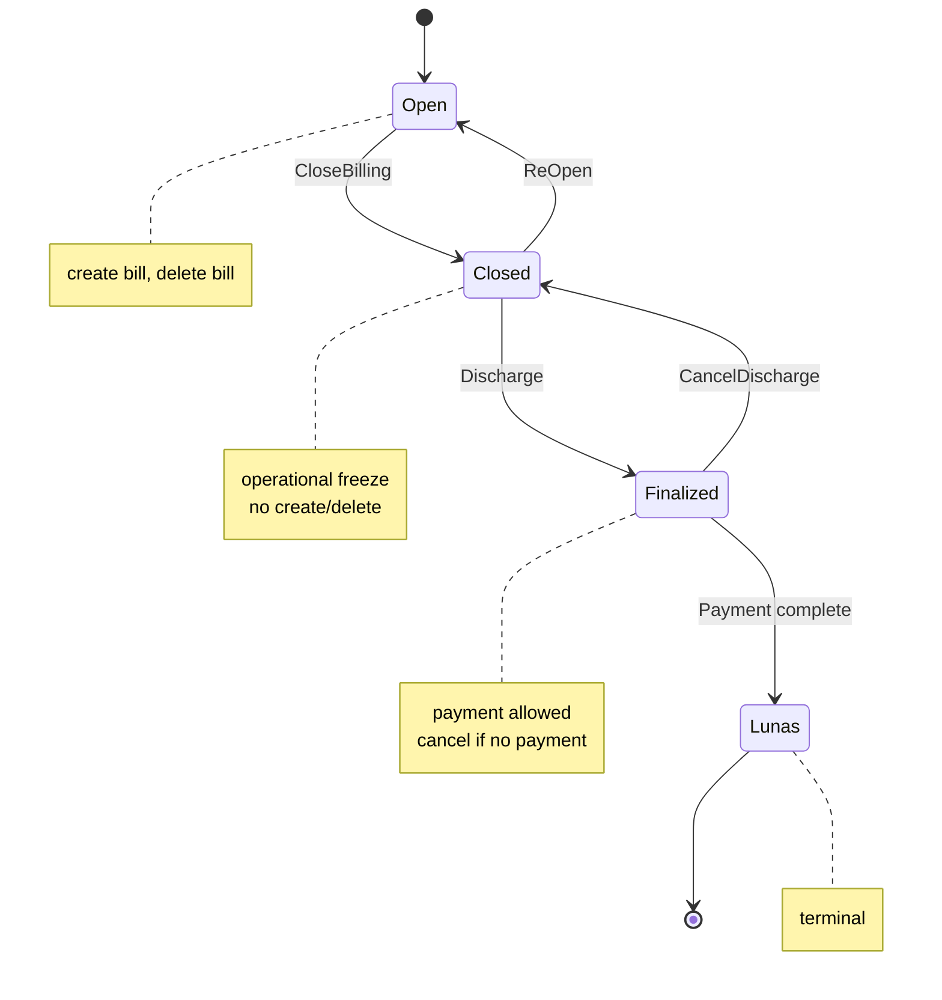

# TRSBILLING Domain Refactor Plan

**Status:** Authoritative implementation plan — domain layer only.  
**Domain reference:** [`trsbilling-02-domain.md`](trsbilling-02-domain.md)  
**Scope:** Aggregates, entities, value objects, domain services, invariants, behavior.  
**Out of scope:** Repository, infrastructure, persistence, EF Core, SQL, DAL, ACL, application handlers, API, event bus.

---

## Confirmed business decisions

These decisions are final for implementation. Do not re-open during domain work.

| # | Decision |
|---|----------|
| **BD-1** | `TataRekening` and `TrsBill` are **separate aggregates** with **no containment** — no bill registry on `TataRekening`. |
| **BD-2** | Discharge allocation **user input** is `(Provider, ModulGroup, Amount)` only. User never specifies `BillId` / `TrsBillId`. Bill distribution is **calculated by domain logic**. |
| **BD-3** | Payment is allowed **only when `TataRekening` is FINALIZED**. `OPEN → Payment` and `CLOSED → Payment` are **impossible**. |
| **BD-4** | `CancelDischarge()` and `ReOpen()` are **distinct** operations. Cancel revokes financial allocation (FINALIZED → CLOSED, operational freeze retained). `ReOpen()` restores operational billing (CLOSED → OPEN). |
| **BD-5** | Discharge is entered only from **CLOSED** (`CloseBilling()` must precede `Discharge()`). |

---

## Architectural model

| Concept | Owner |
|---------|--------|
| Lifecycle **authority** (may / may not) | `TataRekening` — guards and self-state transitions |
| Lifecycle **orchestration** across aggregates | **Domain services** |
| Charge snapshot & Level-2 decomposition | `TrsBill` |
| Level-1 allocation **state** | `TataRekening` |
| Level-1 → bill distribution math | **`DischargeAllocationCalculator`** / **`PaymentAllocationCalculator`** |
| Loading bills by `RegId` | Caller / query port; bills passed as arguments |

---

## Executive summary

The codebase has moved away from obsolete `TrsBillingRegister` (absent from live domain; only in deprecated docs and commented code). Two aggregate roots exist in code:

| Target aggregate | Current type | Maturity |
|------------------|--------------|----------|
| `TataRekening` | `TataRekeningModel` | Skeleton — status enum and payment shape; guards and mutators missing |
| `TrsBill` | `TrsBillType` | Partial — charge snapshot and three component types; public lifecycle API inverted |

`CreateBillService` is aligned with the target and should be **kept and extended**.

**Highest-risk gaps:**

1. `TrsBillType` exposes `Discharge()`, `Pay()`, `CancelDischarge()` publicly — must move to domain-service orchestration.
2. No cross-bill discharge invariant or JASA/OBAT partition enforcement.
3. `Pay()` decomposes from transaction components instead of discharge components.
4. `Modul` always `0` in factory — partition rule not implemented.
5. Payment and discharge lack FINALIZED / CLOSED lifecycle guards.

---

## Lifecycle

### State machine

```text
OPEN
    ↓ CloseBilling()
CLOSED
    ↓ Discharge()              [DischargeBillService — CLOSED only]
FINALIZED
    ↓ Payment complete         [PaymentBillService — FINALIZED only]
LUNAS

CLOSED
    ↓ ReOpen()                 [TataRekening.ReOpen]
OPEN

FINALIZED
    ↓ CancelDischarge()        [DischargeBillService.Cancel]
CLOSED
```



### Allowed operations by state

| State | Allowed | Forbidden |
|-------|---------|-----------|
| **OPEN** | Create bill, delete bill, `CloseBilling()` | Discharge, payment, `ReOpen()` |
| **CLOSED** | `Discharge()`, `ReOpen()` | Create bill, delete bill, payment |
| **FINALIZED** | Payment, `CancelDischarge()` (no payment exists) | Create bill, delete bill, `ReOpen()` |
| **LUNAS** | None | All mutations |

### Composite path after cancelled discharge

To add/remove bills after allocation was revoked:

```text
FINALIZED → CancelDischarge() → CLOSED → ReOpen() → OPEN
```

### Forbidden transitions

| From | To | Reason |
|------|-----|--------|
| OPEN | FINALIZED | Must `CloseBilling()` first |
| OPEN | Payment / LUNAS | Payment requires FINALIZED (BD-3) |
| CLOSED | Payment / LUNAS | Payment requires FINALIZED (BD-3) |
| FINALIZED | OPEN | Must cancel → CLOSED, then `ReOpen()` |
| LUNAS | Any | Terminal state |

### CancelDischarge vs ReOpen

| Operation | Transition | Purpose |
|-----------|------------|---------|
| `CancelDischarge()` | FINALIZED → CLOSED | Revoke financial responsibility allocation; clear discharge components; **operational freeze retained** |
| `ReOpen()` | CLOSED → OPEN | Re-enable bill create/delete and operational billing |

---

## 1. Current model assessment

### 1.1 Aggregates

| Type | Location | Relation to target |
|------|----------|-------------------|
| `TataRekeningModel` | `TataRekeningFeature/TataRekeningModel.cs` | Target authority aggregate — incomplete |
| `TrsBillType` | `TrsBillFeature/TrsBillType.cs` | Target charge aggregate — over-scoped lifecycle |

### 1.2 Charge aggregate entities

| Type | Purpose | Alignment |
|------|---------|-----------|
| `TrsBillType` | Financial charge root | Core structure matches |
| `TrsBill2TransEventType` | Transaction component | Matches — immutable at creation |
| `TrsBill2DischargeEventType` | Discharge component | Matches |
| `TrsBill2PaymentEventType` | Payment component | Matches |

### 1.3 Value objects

| Type | Purpose | Alignment |
|------|---------|-----------|
| `TrsBillNilaiType` | Pricing snapshot | Matches |
| `TrsBill2CoaType` | Accounting snapshot | Matches |
| `TrsBill2KomponenType` | Component identity | Matches |
| `TrsBillJenisBayarType` | Payer line classification | Matches |
| `TrsBillKetType` | Source reference | Matches |
| `PaymentType` | Provider identity (BPJS, KAS, …) | Matches Level-1 provider |
| `TataRekeningPaymentType` | Payment record with Jasa/Obat split | Keep — adapt to payment input model |
| `CoaType` | COA reference | Valid; namespace `TrsBillingFeature` is legacy |
| `TrsBillStatusEnum` | Derived projection | Keep — non-authoritative for lifecycle |

### 1.4 Domain services (current)

| Service | Verdict |
|---------|---------|
| `CreateBillService` | **Keep** — correct create coordinator |
| `TrsBillFactory` | **Keep** — creation helper only |
| `DeleteBillService` | **Create** |
| `DischargeBillService` | **Create** |
| `PaymentBillService` | **Create** |

### 1.5 Behavioral gaps

| Behavior | Target | Current | Gap |
|----------|--------|---------|-----|
| Create bill | `CreateBillService` + OPEN guard | Partial OPEN rule | Tighten guards |
| Delete bill | `DeleteBillService` + OPEN guard | Missing | Implement |
| Close / ReOpen | `TataRekening` mutators | Missing | Implement |
| Discharge | `DischargeBillService` from CLOSED | Per-bill on `TrsBill` | Inverted; no 100% invariant |
| Payment | `PaymentBillService` from FINALIZED only | Per-bill on `TrsBill` | Inverted; no status guard |
| Cancel discharge | `DischargeBillService.Cancel` → CLOSED | Per-bill | Not coordinated |
| Bill distribution | Calculator from `(Provider, ModulGroup, Amount)` | N/A | Not implemented |
| JASA/OBAT partition | Domain invariant | `Modul` always `0` | Missing |

---

## 2. Mapping matrix

| Existing / planned | Action | Reasoning |
|--------------------|--------|-----------|
| `TataRekeningModel` | **Modify** | Lifecycle state, Level-1 records, guards, self-mutators — no bill collection |
| `TataRekeningStatusEnum` | **Modify** | Optional rename `Opened`→`Open`, `Paid`→`Lunas`; transition guards |
| `TrsBillType` | **Modify** | Remove public lifecycle API; internal decomposition methods |
| `CreateBillService` | **Keep / modify** | OPEN guard + factory; no `TataRekening` mutation |
| `DeleteBillService` | **Create** | Cross-aggregate delete |
| `DischargeBillService` | **Create** | Cross-aggregate discharge + cancel |
| `PaymentBillService` | **Create** | Cross-aggregate payment; FINALIZED guard |
| `TrsBillFactory` | **Keep / modify** | Set `BillModulGroup` |
| `BillModulGroup` | **Create** | `Jasa = 0`, `Obat = 1` — align with `fn_modul` |
| `DischargeAllocationInput` | **Create** | `(Provider, ModulGroup, Amount)` — **no BillId** (BD-2) |
| `PaymentAllocationInput` | **Create** | `(Provider, ModulGroup, Amount)` — symmetric with discharge |
| `DischargeAllocationCalculator` | **Create** | Distributes provider amount across eligible bills by outstanding |
| `PaymentAllocationCalculator` | **Create** | Distributes payment across discharged bills by modul group |
| `TataRekeningDischargeAllocation` | **Create** | **Persisted record** of user input + outcome — not a bill target |
| `RegisterBill()` / `GetBills()` on `TataRekening` | **Do not create** | Violates BD-1 |
| `TrsBillType.Discharge/Pay/CancelDischarge` (public) | **Remove** | Replace with internal methods + domain services |
| `CoaType` namespace | **Rename** | `TrsBillingFeature` → `CoaFeature` |
| `TrsBillingRegister` | **Remove** (concept) | Obsolete |
| `RegOutFeature` types | **Remove** (Phase 7) | Legacy overlap |

---

## 3. Aggregate refactoring plan

### 3.1 TataRekening

**Owns:** lifecycle state, Level-1 discharge/payment records, guards, self-mutators, invariant validation over bill arguments.

**Does not own:** bill collection, pricing/accounting snapshots, Level-2 math, bill iteration during orchestration.

#### Structure

```
TataRekeningModel
├── RegId
├── Status
├── DischargeAllocations: IEnumerable<DischargeAllocationInput>   // user input records
├── Payments: IEnumerable<PaymentAllocationInput>                   // or TataRekeningPaymentType
│
├── Guards
│   ├── EnsureCanCreateBill()         // Status == Open
│   ├── EnsureCanDeleteBill()         // Status == Open
│   ├── EnsureCanCloseBilling()       // Status == Open
│   ├── EnsureCanReOpen()             // Status == Closed
│   ├── EnsureCanDischarge()          // Status == Closed
│   ├── EnsureCanAllocatePayment()    // Status == Finalized  (BD-3)
│   └── EnsureCanCancelDischarge()    // Status == Finalized, no payment on any bill
│
└── Mutators (self only)
    ├── CloseBilling()                // Open → Closed
    ├── ReOpen()                      // Closed → Open
    ├── RecordDischarge(allocations)  // → Finalized
    ├── ValidateDischargeComplete(bills, allocations)
    ├── RecordPayment(payment)
    ├── CancelDischarge()             // Finalized → Closed
    └── MarkLunas()                   // Finalized → Lunas
```

#### CancelDischarge vs ReOpen

- **`CancelDischarge()`** — revokes allocation; FINALIZED → CLOSED; does **not** allow create/delete.
- **`ReOpen()`** — CLOSED → OPEN; re-enables create/delete. Required after cancel if user must add bills.

---

### 3.2 TrsBill

**Owns:** charge identity, pricing/accounting snapshot, transaction/discharge/payment components, Level-2 proportional decomposition.

**Does not own:** lifecycle authority, TataRekening status transitions.

#### Internal methods (invoked by domain services only)

| Method | Purpose |
|--------|---------|
| `ApplyDischargeAllocation(jenisBayar, billShare, …)` | Split bill share across transaction components |
| `ApplyPaymentAllocation(payment, billShare, …)` | Split bill share across **discharge** components |
| `ClearDischargeComponents()` | Remove discharge lines (cancel discharge) |
| `GetOutstanding()` | For calculator input |
| `GetTotalDischarged()` / `GetTotalPaid()` | For invariant checks |
| `EnsureDeletable()` | No discharge/payment components (optional) |

#### Component generation rules

```text
Discharge Component = Transaction Component + payer ownership + proportional value
Payment Component   = Discharge Component + payment ownership + proportional settlement
```

---

## 4. Allocation model

### 4.1 User input (BD-2)

Discharge and payment allocation input from user/cashier workflow:

```text
(Provider, ModulGroup, Amount)
```

Examples:

```text
BPJS | JASA | 4000
BPJS | OBAT | 1000
KAS  | JASA | 2500
```

User **never** specifies `BillId`, `TrsBillId`, or target bill. Domain calculates bill shares.

### 4.2 Level 1 — Provider → Bill (domain-calculated)

```text
DischargeBillService / DischargeAllocationCalculator
  Input:  (Provider, ModulGroup, Amount) + eligible bills (same ModulGroup)
  Output: Dictionary<TrsBillId, decimal billShare>   // internal only
```

Distribution rule (implement in calculator):

1. Filter bills where `BillModulGroup == allocation.ModulGroup`.
2. Compute each bill's outstanding receivable.
3. Distribute `Amount` proportionally across eligible bills by outstanding.
4. Last-bill rounding adjustment (same pattern as existing component split).

Partition invariant: **BPJS JASA** never touches OBAT bills (BD-2 + `02-domain.md` §11).

### 4.3 Level 2 — Bill → Components (`TrsBill`)

For each calculated `billShare`:

```text
trsBill.ApplyDischargeAllocation(...)   // discharge
trsBill.ApplyPaymentAllocation(...)     // payment
```

### 4.4 Discharge completeness invariant

```text
Σ DischargeAllocationInput.Amount (per ModulGroup and total)
=
Σ TrsBill.Outstanding (per ModulGroup and total)
```

Partial discharge is forbidden. Shortfall requires additional provider line (e.g. SUBSIDI RS).

---

## 5. Domain service plan

All services receive pre-loaded aggregates. Bills are loaded by `RegId` outside domain (repository/query port).

### 5.1 CreateBillService — keep, modify

```text
1. tataRekening.EnsureCanCreateBill()    // Open only
2. trsBill = TrsBillFactory.Create(...)
3. return trsBill
```

No `TataRekening` mutation. No `RegisterBill()`.

### 5.2 DeleteBillService — create

```text
1. tataRekening.EnsureCanDeleteBill()    // Open only
2. trsBill.EnsureDeletable()
3. signal physical removal
```

### 5.3 DischargeBillService — create

```text
Discharge(tataRekening, bills, allocations: IEnumerable<DischargeAllocationInput>)

  1. tataRekening.EnsureCanDischarge()           // Closed only (BD-5)
  2. For each allocation (Provider, ModulGroup, Amount):
       billShares = DischargeAllocationCalculator.Distribute(bills, allocation)
       foreach (bill, share) → bill.ApplyDischargeAllocation(...)
  3. tataRekening.ValidateDischargeComplete(bills, allocations)
  4. tataRekening.RecordDischarge(allocations)   // → Finalized

Cancel(tataRekening, bills)

  1. tataRekening.EnsureCanCancelDischarge()
  2. foreach bill → bill.ClearDischargeComponents()
  3. tataRekening.CancelDischarge()              // → Closed (BD-4)
```

### 5.4 PaymentBillService — create

```text
Allocate(tataRekening, bills, payment: PaymentAllocationInput)

  1. tataRekening.EnsureCanAllocatePayment()     // Finalized only (BD-3)
  2. billShares = PaymentAllocationCalculator.Distribute(bills, payment)
  3. foreach (bill, share) → bill.ApplyPaymentAllocation(...)
  4. tataRekening.RecordPayment(payment)
  5. if fully settled → tataRekening.MarkLunas()
```

**Impossible paths (must throw):**

```text
Open    + PaymentBillService.Allocate  → throw
Closed  + PaymentBillService.Allocate  → throw
```

### 5.5 Coordinator reference

| Operation | Coordinator | `TataRekening` |
|-----------|-------------|----------------|
| Create bill | `CreateBillService` | `EnsureCanCreateBill` |
| Delete bill | `DeleteBillService` | `EnsureCanDeleteBill` |
| Close billing | Caller / thin wrapper | `CloseBilling` |
| Re-open billing | Caller / thin wrapper | `ReOpen` |
| Discharge | `DischargeBillService` | `EnsureCanDischarge`, `ValidateDischargeComplete`, `RecordDischarge` |
| Payment | `PaymentBillService` | `EnsureCanAllocatePayment`, `RecordPayment`, `MarkLunas` |
| Cancel discharge | `DischargeBillService.Cancel` | `EnsureCanCancelDischarge`, `CancelDischarge` |
| List bills | Repository / query | — |

---

## 6. Implementation phases

Each phase requires domain unit tests before the next begins.

### Phase 1 — Foundation (low risk)

- Introduce `BillModulGroup`, `DischargeAllocationInput`, `PaymentAllocationInput`.
- Populate `BillModulGroup` in `TrsBillFactory`.
- Rename `CoaType` namespace to `CoaFeature`.
- Add all `TataRekening` guard stubs with correct status checks.
- Document `TrsBillStatusEnum` as non-authoritative.

### Phase 2 — Operational lifecycle (medium risk)

- Tighten `CreateBillService` — OPEN only.
- Implement `DeleteBillService`.
- Implement `CloseBilling()`, `ReOpen()`.
- Tests: R01–R07 (ReOpen), create/delete blocked when not OPEN.

### Phase 3 — TrsBill decomposition (medium risk)

- `ApplyDischargeAllocation`, `ApplyPaymentAllocation`, `ClearDischargeComponents`.
- Payment base = discharge components.
- `GetOutstanding`, `GetTotalDischarged`, `GetTotalPaid`, `EnsureDeletable`.
- Obsolete public wrappers until Phase 4/5.

### Phase 4 — Discharge orchestration (high risk)

- Implement `DischargeAllocationCalculator` — **no BillId in input**.
- Implement `DischargeBillService` + `ValidateDischargeComplete`, `RecordDischarge`.
- Tests: D01–D02 (CLOSED only), partition, 100% invariant, SUBSIDI RS top-up, calculator distribution.

### Phase 5 — Payment orchestration (high risk)

- Implement `PaymentAllocationCalculator`.
- Implement `PaymentBillService` with **FINALIZED-only** guard.
- Implement `RecordPayment`, `MarkLunas`.
- Tests: P01–P06 (see Appendix A), Payment-1/2/3 sequence, over-payment guard.

### Phase 6 — Cancel discharge (medium risk)

- Implement `DischargeBillService.Cancel`.
- Tests: C01–C06 (cancel → CLOSED; ReOpen path; payment blocks cancel).

### Phase 7 — Cleanup (low risk)

- Remove `RegOutFeature` legacy types if unused.
- Optional enum rename (`Opened`→`Open`, `Paid`→`Lunas`).
- Transaction component immutability enforcement.

---

## Appendix A — Invariant & test checklist

### Lifecycle & authority

| ID | Invariant | Enforced by | Phase |
|----|-----------|-------------|-------|
| L01 | Bill create only when OPEN | `EnsureCanCreateBill` | 2 |
| L02 | Bill delete only when OPEN | `EnsureCanDeleteBill` | 2 |
| L03 | Discharge only when CLOSED | `EnsureCanDischarge` | 4 |
| L04 | Payment only when FINALIZED | `EnsureCanAllocatePayment` | 5 |
| L05 | OPEN → Payment impossible | `PaymentBillService` | 5 |
| L06 | CLOSED → Payment impossible | `PaymentBillService` | 5 |
| L07 | Cancel discharge only when FINALIZED, no payment | `EnsureCanCancelDischarge` | 6 |
| L08 | Cancel discharge → CLOSED (not OPEN) | `CancelDischarge` | 6 |
| L09 | ReOpen only CLOSED → OPEN | `EnsureCanReOpen` | 2 |
| L10 | ReOpen forbidden from FINALIZED, LUNAS | `EnsureCanReOpen` | 2 |
| L11 | No mutation after LUNAS | All guards | 5 |

### Allocation

| ID | Invariant | Enforced by | Phase |
|----|-----------|-------------|-------|
| A01 | Discharge input = Provider + ModulGroup + Amount only | `DischargeAllocationInput` | 1 |
| A02 | User never supplies BillId | API/domain input model | 1 |
| A03 | Bill distribution calculated by domain | `DischargeAllocationCalculator` | 4 |
| A04 | JASA allocation → JASA bills only | Calculator + `ValidateDischargeComplete` | 4 |
| A05 | OBAT allocation → OBAT bills only | Calculator + `ValidateDischargeComplete` | 4 |
| A06 | Σ allocation = Σ outstanding (100%) | `ValidateDischargeComplete` | 4 |
| A07 | Partial discharge forbidden | `DischargeBillService` | 4 |
| A08 | Payment decomposes from discharge components | `ApplyPaymentAllocation` | 3 |

### Test scenarios

**ReOpen (Phase 2):** R01 CLOSED→OPEN; R02 OPEN→ReOpen throws; R03 FINALIZED→ReOpen throws; R04 LUNAS→ReOpen throws; R05 ReOpen then create bill succeeds; R06 ReOpen then delete succeeds; R07 Close→ReOpen→Close round-trip.

**Discharge (Phase 4):** D01 OPEN→Discharge throws; D02 CLOSED→Discharge succeeds; D03 two-line input (BPJS JASA + BPJS OBAT) distributes to correct bill groups; D04 partial amount throws; D05 calculator splits across 3 JASA bills by outstanding.

**Payment (Phase 5):** P01 OPEN→Payment throws; P02 CLOSED→Payment throws; P03 FINALIZED→Payment succeeds; P04 Payment-1/2/3 partial then LUNAS; P05 over-payment throws; P06 JASA payment does not touch OBAT bills.

**Cancel (Phase 6):** C01 FINALIZED→Cancel→CLOSED; C02 after cancel create bill throws; C03 Cancel→ReOpen→create succeeds; C04 cancel with payment throws; C05 discharge components cleared; C06 Cancel→ReOpen→Close→Discharge full path.

---

## Appendix B — Code references (current)

| Concern | File |
|---------|------|
| TataRekening | `Bilreg.Domain/PaymentContext/TataRekeningFeature/TataRekeningModel.cs` |
| TrsBill | `Bilreg.Domain/PaymentContext/TrsBillFeature/TrsBillType.cs` |
| CreateBillService | `Bilreg.Domain/PaymentContext/TrsBillFeature/CreateBillService.cs` |
| TrsBillFactory | `Bilreg.Domain/PaymentContext/TrsBillFeature/TrsBillFactory.cs` |
| Transaction component | `Bilreg.Domain/PaymentContext/TrsBillFeature/TrsBill2TransEventType.cs` |
| Discharge component | `Bilreg.Domain/PaymentContext/TrsBillFeature/TrsBill2DischargeEventType.cs` |
| Payment component | `Bilreg.Domain/PaymentContext/TrsBillFeature/TrsBill2PaymentEventType.cs` |
| Domain test (create) | `Bilreg.Test/PaymentContext/TrsBillingFeature/TrsBillCreationDomainServiceTest.cs` |

---

## Appendix C — Deferred (outside domain scope)

- `ta_trs_billing` / `TrsBillingDal` persistence
- Repository `ListByRegId(RegId)`
- Application command handlers, API controllers
- `TrsbListSummaryBillQuery`, journal generation

Revisit after Phases 4–5 domain tests pass.

---

## Appendix D — Implementation readiness assessment

| Area | Readiness | Notes |
|------|-----------|-------|
| Domain model clarity | **Ready** | `02-domain.md` + confirmed decisions BD-1–BD-5 |
| Aggregate boundaries | **Ready** | Separate aggregates, no containment, service coordination defined |
| Allocation input model | **Ready** | `(Provider, ModulGroup, Amount)` — no BillId |
| Lifecycle | **Ready** | Full state machine including ReOpen and CancelDischarge |
| Payment gate | **Ready** | FINALIZED only — explicit guards and tests |
| Existing code alignment | **Partial** | `TrsBillType` lifecycle inverted; `Modul` unset; guards missing |
| Test coverage | **Low** | Only `TrsBillCreationDomainServiceTest` (3 cases) |
| Persistence / API | **Not started** | Intentionally deferred |

### Recommended start

**Phase 1** — low risk, unblocks all later work. No application-layer changes required until Phase 2.

### Blockers

None for domain implementation. Optional enum rename (`Opened`/`Paid`) is cosmetic and can be deferred to Phase 7.

### Agent instruction

Implementation agents must use **this document only** as the refactor plan. Superseded concepts: `TrsBillingRegister`, `RegisterBill()`, bill-targeted discharge input, payment from OPEN/CLOSED, aggregate bill containment.
