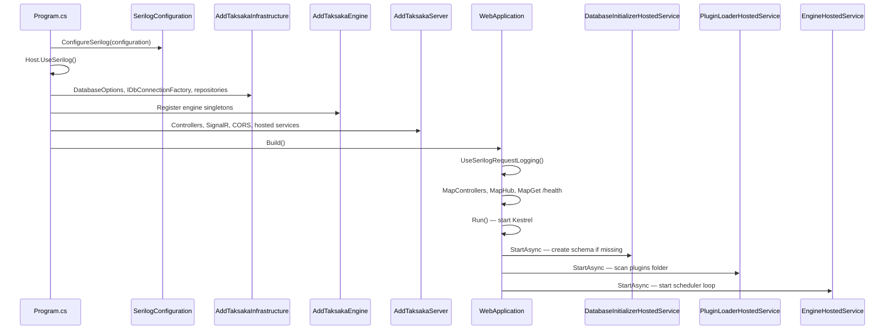
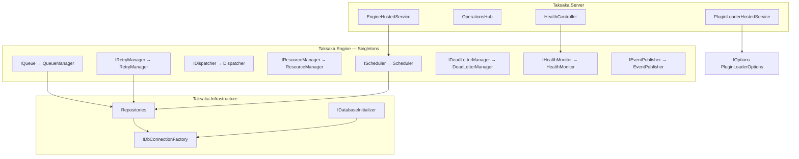
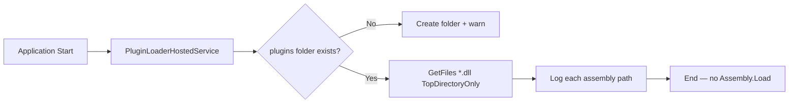
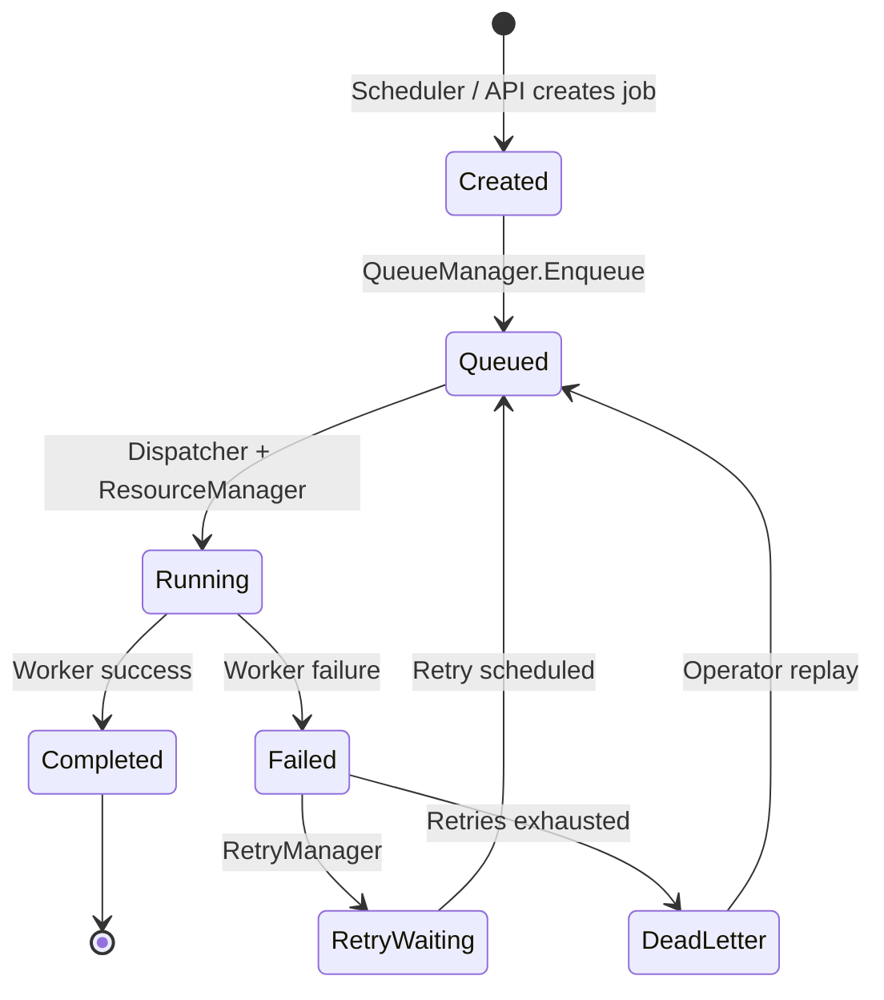
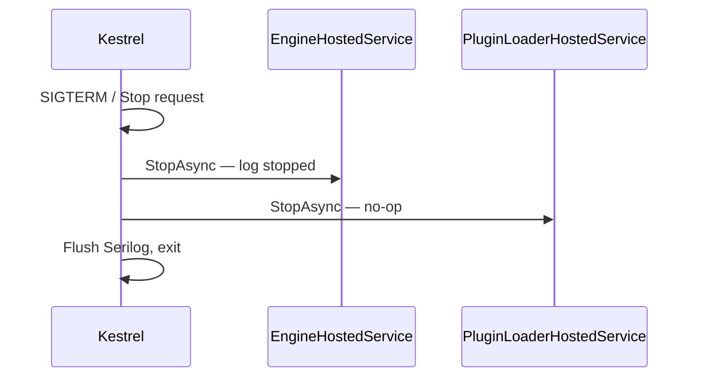

# Taksaka — Architecture at Runtime

How the **implemented** system starts, wires dependencies, and behaves at runtime. Target architecture from domain docs is noted where implementation is still a stub.

---

## Solution Topology

```text
src/taksaka.backend/
  Taksaka.Server          ← ASP.NET Core host (Kestrel)
  Taksaka.Engine          ← Runtime services (singletons)
  Taksaka.Infrastructure  ← Dapper, SQLite/SQL Server, Serilog
  Taksaka.Core            ← Entities, enums, policies
  Taksaka.Abstractions    ← IWorker, IQueue, IDispatcher, ...
  Taksaka.Workers.*       ← Plugin DLLs (sample workers)

src/taksaka.frontend/
  Taksaka.Web             ← Vue 3 operator console (shell)
```

---

## Startup Sequence



### Step-by-step

1. **`Program.cs`** creates `WebApplicationBuilder`.
2. **Serilog** configured from `IConfiguration`; host uses Serilog.
3. **`AddTaksakaInfrastructure`** binds `DatabaseOptions`, registers `IDbConnectionFactory`, Dapper repositories, and `DatabaseInitializerHostedService`.
4. **`AddTaksakaEngine`** registers engine singletons (queue, retry, scheduler wired to repositories).
5. **`AddTaksakaServer`** registers MVC, Swagger, FluentValidation, SignalR, CORS, hosted services.
6. **Middleware pipeline:** request logging → (Swagger dev only) → CORS → routing → endpoints.
7. **Hosted services** start: schema init, plugin scan, scheduler loop.
8. **Kestrel** listens on configured URLs.

**Not started today:**

- Dispatcher background loop (worker execution pipeline)
- Worker plugin loading into runtime

---

## Dependency Injection



| Registration | Lifetime | Implementation |
|--------------|----------|----------------|
| `IScheduler` | Singleton | `Scheduler` (repository-backed loop) |
| `IQueue` | Singleton | `QueueManager` (Dapper persistence) |
| `IDispatcher` | Singleton | `Dispatcher` (no-op — no worker pipeline) |
| `IResourceManager` | Singleton | `ResourceManager` (always Allow) |
| `IRetryManager` | Singleton | `RetryManager` (Dapper persistence) |
| `IDeadLetterManager` | Singleton | `DeadLetterManager` (Dapper persistence) |
| `IHealthMonitor` | Singleton | `HealthMonitor` (static Healthy) |
| `IEventPublisher` | Singleton | `EventPublisher` (no-op) |
| `IJobRepository` etc. | Singleton | Dapper repositories in Infrastructure |
| `IWorker` | **Not registered** | Plugins not loaded |

Workers are **not** in the DI container. Engine does not resolve `IWorker` today.

---

## Worker Discovery



**Build-time packaging** (`Taksaka.Server.csproj` `CopyPlugins` target):

- Copies `Taksaka.Workers.Projection.dll` and `Taksaka.Workers.Integration.dll` to `bin/.../plugins/`
- Worker projects use `ReferenceOutputAssembly=false` — not linked into host assembly

**Future (not implemented):**

- Load assemblies into `AssemblyLoadContext`
- Reflect types implementing `IWorker`
- Register or catalog in worker registry

---

## Job Lifecycle

**Target lifecycle** (architecture):



**Current implementation:** `Job` entity exists with `JobStatus` enum. No code transitions states. `QueueManager`, `Dispatcher`, and workers are not connected.

---

## Scheduler Lifecycle

| Method | Current behavior |
|--------|------------------|
| `StartAsync` | Returns completed task |
| `StopAsync` | Returns completed task |

`EngineHostedService` does **not** call `IScheduler`. No cron, timer, or background service drives scheduling.

---

## Dispatch Pipeline

**Target pipeline** (from architecture doc):

```text
Dequeue → ResourceManager.TryAcquire → Middleware chain → IWorker.ExecuteAsync
  → Release resource → Publish events → Persist history
```

**Current `Dispatcher`:**

```csharp
public Task DispatchNextAsync(...) => Task.CompletedTask;
```

No dequeue, no worker invocation, no middleware types exist in codebase.

---

## Middleware Execution

**Not implemented.** No middleware pipeline classes (logging, metrics, timeout, transaction wrappers) exist in `Taksaka.Engine`.

Workers are responsible for their own logic only in the target design; cross-cutting concerns belong to engine middleware — **future work**.

---

## Resource Manager

```csharp
public Task<ResourceDecision> TryAcquireAsync(...) =>
    Task.FromResult(ResourceDecision.Allow());
```

Always permits execution. `WorkerExecutionPolicy.MaxConcurrency` on descriptors is **not read** by `ResourceManager`.

---

## Error Handling

| Layer | Behavior |
|-------|----------|
| ASP.NET Core | Standard exception middleware / developer page in dev |
| Engine dispatch | No dispatch loop — no engine-level catch |
| Worker | `WorkerResult.Failure(message)` contract exists; unused |
| Dead letter | Stub — no movement on failure |
| Retry | Stub — no scheduling |

---

## Retry

`IRetryManager.ScheduleRetryAsync` — no-op.

Per-worker policy (`MaxRetryCount`) is defined on sample workers but not enforced:

| Worker | MaxRetryCount |
|--------|---------------|
| `sample-integration` | 5 |
| `sample-projection` | null (unlimited) |

---

## Dead Letter

`IDeadLetterManager.MoveToDeadLetterAsync` — no-op.

`JobStatus.DeadLetter` reserved for future persistence.

---

## Event Publishing

`IEventPublisher.PublishAsync<T>` — no-op.

Domain event type exists: `JobCreatedEvent`. SignalR hub method `PublishHealthChanged` is not invoked by engine.

**SignalR hub endpoint:** `/hubs/operations` (`SignalREndpoints.Operations`)

**Client event (subscribed in frontend):** `HealthChanged`

---

## Health Monitoring

`HealthMonitor.EvaluateAsync` returns:

```csharp
new HealthSnapshot {
    Dimension = "Platform",
    State = HealthState.Healthy,
    EvaluatedAt = DateTimeOffset.UtcNow
}
```

`HealthController` exposes this at `GET /api/health`.

Minimal liveness at `GET /health` bypasses `IHealthMonitor`.

---

## HTTP API Surface

| Route | Handler |
|-------|---------|
| `GET /health` | Minimal API lambda |
| `GET /api/health` | `HealthController` |
| `GET /swagger` | Swagger UI (Development only) |
| `/hubs/operations` | SignalR `OperationsHub` |

No controllers for queue, jobs, workers, scheduler, alerts, or dead letter.

---

## Shutdown Sequence



No graceful job drain. In-flight work (when exists) would be terminated with process.

---

## Frontend Runtime

On operator console load (`AppLayout.vue`):

1. Vue app mounts with router + Pinia + PrimeVue.
2. `connectOperationsHub()` attempts SignalR connection to `{VITE_API_BASE_URL}/hubs/operations`.
3. Subscribes to `HealthChanged` → logs to browser console.
4. Route pages render placeholders except layout/navigation.

Vite dev server proxies `/api` and `/hubs` to `localhost:5000`.

---

## Implementation vs Vision Gap

| Capability | Vision (domain/architecture) | Implemented |
|------------|------------------------------|-------------|
| Persistent queue | Yes | Stub |
| Job dispatch loop | Yes | Stub |
| Plugin load + execute | Yes | Scan only |
| Scheduler | Yes | Stub |
| Retry / dead letter | Yes | Stub |
| Execution history persistence | Yes | Entity only |
| Operator API | Yes | Health only |
| Operator UI dashboards | Yes | Placeholders |
| Authentication | Expected for prod | None |

---

## Related Documents

- [docs/contexts/taksaka/taksaka-02-architecture.md](../contexts/taksaka/taksaka-02-architecture.md) — full vision
- [02-configuration-reference.md](02-configuration-reference.md)
- [06-plugin-development-guide.md](06-plugin-development-guide.md)
