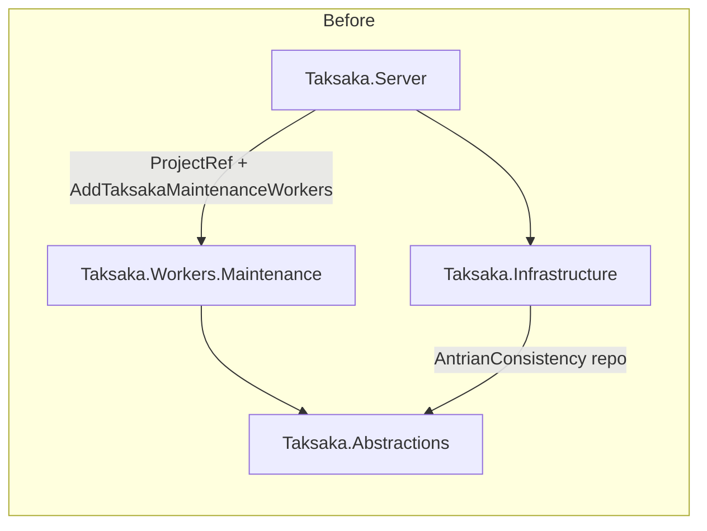
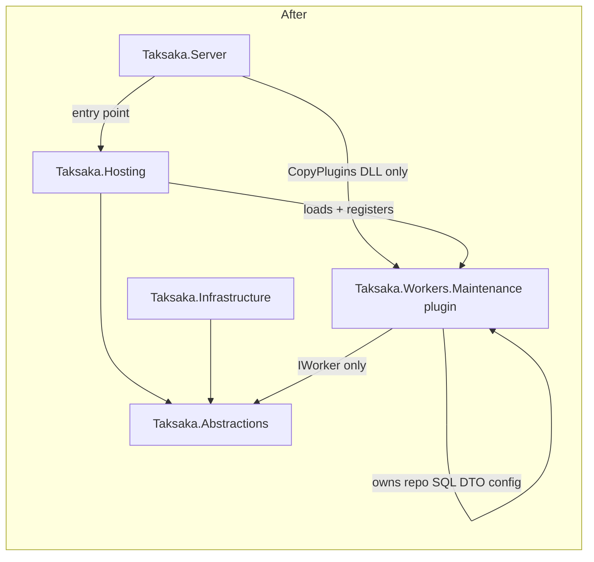

# Antrian Worker Refactor — Dependency Diagram

## Before

## After

## Summary

- Platform projects no longer reference worker-specific types.
- `AntrianConsistencyRepairWorker` is self-contained with internal repository, SQL, models, configuration, and composition root.
- Host discovers and registers the plugin via manifest + assembly reflection.
