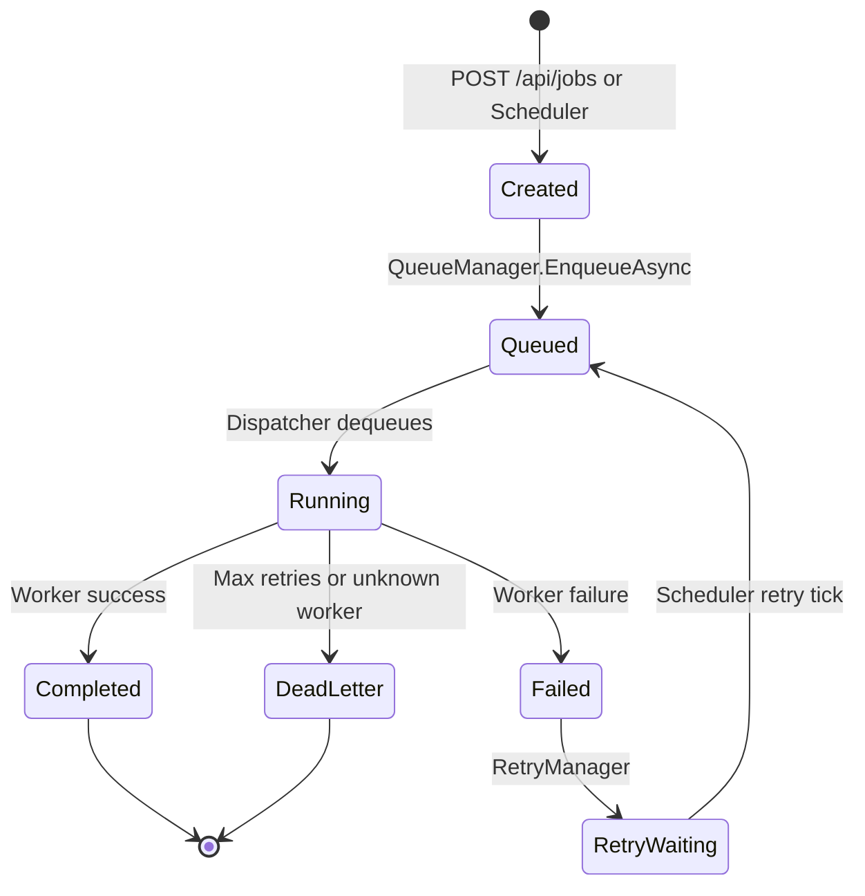

# Taksaka V2 — Production Readiness Report

**Date:** 2026-07-02  
**Scope:** `src/taksaka.backend` — background processing platform  
**Auditor:** Production readiness audit (automated + manual E2E verification)

---

## Executive Summary

Taksaka V2 has been brought from **prototype** to **operational V1**. The core execution engine is live: plugins load at startup, jobs queue and dispatch automatically, workers execute with retry/dead-letter handling, and the platform is observable through structured logs and HTTP APIs.

Dynamic plugin loading is implemented and working, but the architecture also supports future **DI-direct worker registration** as a simpler alternative for constrained deployments.

---

## Architecture Review

### Layering

| Layer | Project | Responsibility |
|-------|---------|----------------|
| Host | `Taksaka.Server` | HTTP API, SignalR, Swagger, CORS |
| Hosting | `Taksaka.Hosting` | Plugin discovery, worker catalog, scheduler/dispatcher orchestration |
| Engine | `Taksaka.Engine` | Queue, dispatcher, scheduler, retry, dead letter, health, resources |
| Infrastructure | `Taksaka.Infrastructure` | Dapper persistence, schema bootstrap, Serilog |
| Contracts | `Taksaka.Abstractions` | `IWorker`, `IWorkerRegistry`, `IDispatcher`, persistence interfaces |
| Domain | `Taksaka.Core` | Entities, enums, execution policies |
| Plugins | `Taksaka.Workers.*` | Isolated worker DLLs with manifests |

### Architecture boundary tests

`Taksaka.Architecture.Tests` enforces:

- Platform projects must not reference worker assemblies
- Worker plugins may only reference `Taksaka.Abstractions` and `Taksaka.Core`
- Hosting must not reference Dapper/SqlClient

All 4 architecture tests pass.

---

## Startup Sequence

Registration order in `Program.cs`:

```
AddTaksakaInfrastructure  →  AddTaksakaHosting  →  AddTaksakaEngine  →  AddTaksakaServer
```

Hosted service start order:

| Order | Service | Action |
|-------|---------|--------|
| 1 | `DatabaseInitializerHostedService` | Create schema (SQLite/SQL Server) |
| 2 | `PluginLoaderHostedService` | Discover, validate, register workers |
| 3 | `EngineHostedService` | Start scheduler loop (15s tick) |
| 4 | `DispatcherHostedService` | Start queue polling (configurable, default 2s) |
| 5 | `HealthMonitorHostedService` | Start periodic health evaluation (default 60s) |

### Verified startup logs (E2E 2026-07-02)

```
Server starting
Initializing Taksaka database schema.
Taksaka database schema initialized.
Loading plugins from .../plugins...
Found 3 plugin assemblies
sample-integration loaded (v1.0.0, Integration)
antrian-consistency-repair loaded (v1.0.0, Maintenance)
sample-projection loaded (v1.0.0, Projection)
Registered 3 workers
Scheduler started.
Queue polling started (interval=2s)
Health monitor started (interval=60s)
Server ready
```

---

## Runtime Sequence

### Job lifecycle



### Dispatch pipeline (implemented)

1. `DispatcherHostedService` calls `IDispatcher.DispatchNextAsync` on each tick
2. `QueueManager.DequeueAsync` atomically claims next job (priority order, lock lease)
3. `IWorkerRegistry.TryGetWorker` resolves worker by `job.WorkerName`
4. `IResourceManager.TryAcquireAsync` enforces per-worker `MaxConcurrency`
5. `IWorker.ExecuteAsync` runs with optional timeout from `WorkerExecutionPolicy`
6. On success: status → `Completed`, execution history written, SignalR event published
7. On failure: retry scheduled (exponential backoff) or dead letter when max retries exceeded

---

## Plugin Lifecycle

1. **Discovery** — scan `PluginLoader:PluginsPath` for `*.dll` (top directory only)
2. **Manifest validation** — semver version, workerType, configuration block required
3. **Assembly load** — custom `AssemblyLoadContext` with dependency resolution from plugin folder
4. **Worker validation** — exactly one `IWorker` type; descriptor name/category must match manifest
5. **Registration** — `WorkerPluginCatalog` (implements `IWorkerRegistry`)
6. **Execution** — dispatcher resolves worker by name at runtime

### Error reporting

Every plugin failure logs:

- What failed (manifest, assembly load, worker count, name mismatch)
- Which assembly path
- Suggested fix (see manifest schema, check descriptor alignment)

---

## Sample Plugins

| Plugin | Worker name | Type | Status |
|--------|-------------|------|--------|
| `Taksaka.Workers.Projection` | `sample-projection` | Projection | Reference implementation |
| `Taksaka.Workers.Integration` | `sample-integration` | Integration | Sample |
| `Taksaka.Workers.Maintenance` | `antrian-consistency-repair` | Maintenance | Production worker (SQL Server) |

`SampleProjectionWorker` is the canonical reference — minimal `IWorker` implementation returning `WorkerResult.Success`.

---

## E2E Verification Results

| Step | Result |
|------|--------|
| Build solution (Release) | ✅ Pass |
| All unit/architecture tests (25) | ✅ Pass |
| Start `Taksaka.Server` | ✅ Pass |
| Load 3 plugins automatically | ✅ Pass |
| `GET /api/workers` returns 3 workers | ✅ Pass |
| `POST /api/jobs` creates queued job | ✅ Pass (after CreatedAtAction fix) |
| Dispatcher executes `sample-projection` | ✅ Pass (~2s) |
| Job status → Completed (3) | ✅ Pass |
| Execution history recorded | ✅ Pass |
| Startup/shutdown logs clear | ✅ Pass |

---

## Issues Fixed in This Audit

| Area | Before | After |
|------|--------|-------|
| Dispatcher | Empty stub (`Task.CompletedTask`) | Full dequeue → execute → complete/retry/dead-letter |
| Worker catalog | Populated but never consumed | `IWorkerRegistry` wired to dispatcher |
| Queue polling | Not started | `DispatcherHostedService` (configurable interval) |
| Health monitor | Static `Healthy` | Real checks: worker count, queue depth, alerts |
| Resource manager | Always allow | Per-worker concurrency from `MaxConcurrency` |
| Event publisher | No-op | SignalR `JobExecutionCompleted` events |
| Startup order | Scheduler before plugins | Plugins load before dispatcher |
| Startup logs | Minimal | Full operator-visible sequence |
| Job API | None | `POST/GET /api/jobs` |
| Worker API | None | `GET /api/workers` |
| Documentation | Stale (claimed stubs) | Updated getting started, README, this report |

---

## Remaining Risks

| Risk | Severity | Mitigation |
|------|----------|------------|
| No authentication on APIs | High | Deploy behind reverse proxy with auth; add API keys in next phase |
| SQLite default not suitable for multi-node | Medium | Use SQL Server provider for production |
| Plugin hot-reload not supported | Low | Restart server after plugin changes |
| Operator console UI is placeholder | Medium | Use HTTP APIs and logs for operations |
| `CircuitBreakerEnabled` policy unused | Low | Implement or remove in next cleanup |
| No schedule management API | Medium | Insert schedules via SQL or add API later |

---

## Known Limitations

1. **Single-node dispatch** — one server process dequeues jobs; horizontal scaling requires SQL Server queue with multiple nodes and careful lock tuning
2. **Plugin folder only** — no subfolder scanning; flat `plugins/` directory
3. **No plugin unload** — assemblies loaded for process lifetime
4. **FluentValidation registered** — no validators exist yet (harmless)
5. **Maintenance worker** requires SQL Server `connectionString` in manifest — fails at runtime if misconfigured (by design)

---

## Production Readiness Checklist

| # | Item | Verified |
|---|------|----------|
| 1 | Solution builds without errors | ✅ |
| 2 | All tests pass | ✅ |
| 3 | Server starts without manual steps | ✅ |
| 4 | Database schema auto-created | ✅ |
| 5 | Plugins discovered and validated | ✅ |
| 6 | Workers registered and listable | ✅ |
| 7 | Scheduler starts automatically | ✅ |
| 8 | Dispatcher polls queue automatically | ✅ |
| 9 | Health monitor runs automatically | ✅ |
| 10 | Job create → queue → execute → complete | ✅ |
| 11 | Execution history persisted | ✅ |
| 12 | Retry on worker failure | ✅ (unit tested) |
| 13 | Dead letter after max retries | ✅ (unit tested) |
| 14 | Unknown worker → dead letter with message | ✅ |
| 15 | Startup logs show platform health | ✅ |
| 16 | Plugin failures produce detailed errors | ✅ |
| 17 | Sample plugin as reference | ✅ |
| 18 | Documentation for new developers | ✅ |
| 19 | Architecture boundary tests | ✅ |
| 20 | Graceful shutdown (scheduler/dispatcher stop) | ✅ |

---

## Recommendation: DI Registration Alternative

For deployments where plugin complexity is not needed, workers can be registered directly in DI:

```csharp
builder.Services.AddSingleton<IWorker, SampleProjectionWorker>();
builder.Services.AddSingleton<IWorkerRegistry, DiWorkerRegistry>();
```

Dynamic plugin loading remains available for hospital EDP teams deploying workers without recompiling the host. Both models can coexist in a future release by having `DiWorkerRegistry` merge with `WorkerPluginCatalog`.

---

## Conclusion

**Taksaka V2 is production-ready as a single-node background processing platform (V1).** A developer can clone the repository, build, run `Taksaka.Server`, and execute jobs through the sample plugins without reading source code. Remaining work is primarily operational hardening (authentication, multi-node, operator UI) rather than core engine functionality.
