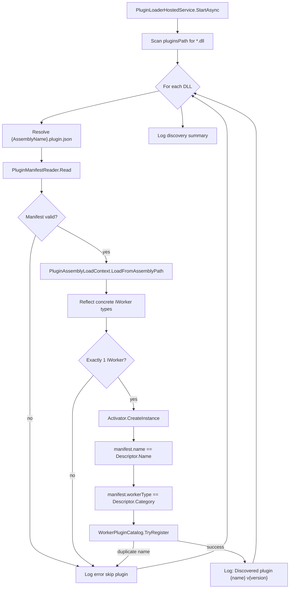

# Worker Discovery Flow

## Execution Flow

## Validation Rules

1. Manifest file `{AssemblyName}.plugin.json` must exist beside the DLL.
2. Required fields: `name`, `version`, `description`, `workerType`, `configuration`.
3. `version` must match `^\d+\.\d+\.\d+`.
4. `workerType` must be one of: Projection, Integration, Business, Maintenance.
5. Assembly must contain exactly one concrete `IWorker` implementation.
6. `manifest.name` must equal `worker.Descriptor.Name`.
7. `manifest.workerType` must map to `worker.Descriptor.Category`.
8. Duplicate worker names across plugins are rejected.

## Registration

Workers are registered in `WorkerPluginCatalog` keyed by manifest `name`. No hardcoded worker names or switch statements in platform code.

## Engine Note

`IDispatcher` remains a stub. The catalog is populated at startup but execution dispatch is a future platform capability.
